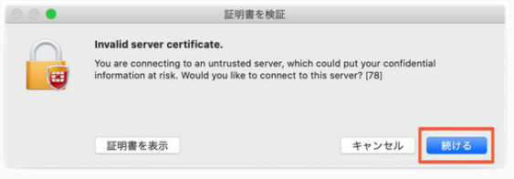
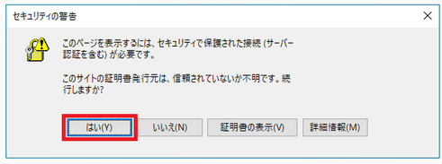

For MacOS, connect using the FortiClient GUI.

1. Enter 'User name' and 'Password'.
    - 'User name': enter the account name for the personal genome listed in the 'Usage category: personal genome analysis division' on the account registration card.
    - 'Password': enter the SSL-VPN password 'VPN password' sent by SECURE DELIVER return mail.

 

2. A further message "Validate certificate" is displayed as follows. Click "Continue"

3. If you see a Security Alert pop-up message, click "Yes". 

:::info
If the dialog box does not appear, refer to [FAQ](/guides/FAQ/faq_personal_genome/faq_forticlient/faq_forticlient#dialogbox_disappear).
:::

A one-time password will be sent to the email address linked to the SSL-VPN account as follows.

If the message is not sent, see [FAQ:Login > FAQ(Login)](/guides/FAQ/faq_personal_genome/faq_forticlient/faq_forticlient#no-onetime-pw-received).

- Windows

4. Enter the one-time password (269274 in the example above) in "Answer" and click "OK".

5. When the following screen appears, VPN connection is established.

