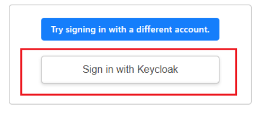

## &#x1F180; Currently, no papers or other deliverables have been published. I have not yet published a paper, what should I do? {#no-publications-or-presentations-yet}

&#x1F150; If you do not have any results to report, you can complete the procedure by entering 'none' as shown below.

## &#x1F180; The following screen appears and I am unable to apply for a renewal of my account of the end of the fiscal year. How can I do this? {#display-keycload}

&#x1F150; [Login according to the instructions provided in the 'Change of application details' division of the 'Applications and changes of use' page.](/application/change_account_info/). After logging in, you can apply for a renewal of your account of the end of the fiscal year.

Also refer to [FAQ](/guides/FAQ/faq_application/faq_renewal).
