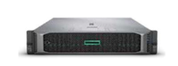
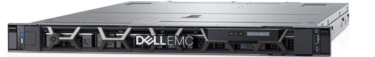
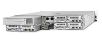
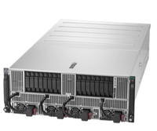
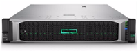
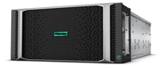

## Overview

<table>
<tbody>
<tr>
    <th colspan="3">Classification</th>
    <th>Specifications</th>
</tr>
<tr>
    <td rowspan="6">
    Compute Nodes
        
	15,424 CPU cores  
	933.560 TFLOPS 
	(CPU: 434.360 TFLOPS, GPU: 499.2 TFLOPS)  
	153.088 TB total memory
    </td>	
	<td rowspan="4">
    Thin nodes
    </td>
    <td>
    Type 1a 
	AMD EPYC 7501 CPU. 
    </td>
    <td>
    136 nodes 
	8,704 CPU cores 
	139.264 TFLOPS 
    69.632 TB total memory（8GB memory/CPU core） 
    </td>
</tr>
<tr>
    <td>
    Type 1b 
	AMD EPYC 7702 CPU. (Expansion in April 2020)
    </td>
	<td>
    28 nodes 
	3,584 CPU cores 
	57.344 TFLOPS 
	14.336 TB total memory (4GB memory/CPU core)
    </td>
</tr>
<tr>
    <td>
    Type 2a 
	Intel Xeon Gold 6130 CPU
    </td>
    <td>
    52 nodes 
    1,664 CPU cores 
	111.800 TFLOPS 
	19.968 TB total memory (12GB memory/CPU core)
    </td>
</tr>
<tr>
    <td>
    Type 2b 
	GPGPU installed
    </td>
	<td>16 nodes 
	384 CPU cores 
    64GPUs (4 GPU/node) 
	536.064 TFLOPS 
	(CPU: 36.864 TFLOPS, GPU: 499.2 TFLOPS) 
	6.144 TB total memory (16GB moemory/CPU core)
    </td>
</tr>
<tr>
    <td colspan="2">
    Medium node 
    3TB of shared memory installed
    </td>
	<td>
    10 nodes 
	800 CPU cores 
	61.440 TFLOPS 
	30.72 TB total memory (38.4GB memory/CPU core)
    </td>
</tr>
    <tr>
	<td colspan="2">
    Fat node 
    Two nodes connected to form 12TB of shared memory</td>
	<td>
    2 node 
	288 CPU cores 
	27.648 TFLOPS 
	12.288 TB total memory (42.7GB memory/CPU core)
    </td>
</tr>
<tr>
    <td rowspan="2">
    Storage
      
    Total storage capacity: 43.8PB
    </td>
	<td colspan="2">
    Large capacity high-speed storage 
	Storage area for analysis(※1)
    </td>
	<td>Lustre file system 
	16.8PB</td>
</tr>
<tr>
    <td colspan="2">
    Large capacity archive storage 
	Storage area for DB(※2)
    </td>
	<td>SpectrumScale file system + tapes 
	30PB (Disk Capacity 15PB、Hierarchical tape storage 15PB)
    </td>
</tr>
<tr>
			<td colspan="3">Inter-node interconnect network</td>
			<td>
            InfiniBand 4×EDR 100Gbps fat tree 
            (For storage, full bi-section; for compute nodes, connection bandwidth to upstream SW : connection bandwidth to downstream SW = 1:4)
            </td>
		</tr>
	</tbody>
</table>

- ※1. Storage area for analysis: This area contains user home area in general analysis area and personal genome analysis area
- ※2. Storage area for DB: This area contains DDBJ databases such as DRA. These databases can be accessed from general analysis area.

## Compute nodes

### Thin compute node Type 1a (HPE ProLiant DL385 Gen10; 136 computers)

Compute nodes with AMD EPYC 7501 processors.

 

HPE ProLiant DL385 Gen10
(host name: at001 -- at136)
	

| component |model number                                       | number of computation | performance par node, etc      |
|-----------|---------------------------------------------------|-----------------------|--------------------------------|
| CPU       | AMD EPYC 7501 (32 cores)  Base 2.0GHz, Max 3.0GHz |                     2 | Total 64 core                  |
| Memory    | 32GB DDR4-2666                                    |                    16 | Total 512GB (8GB par CPU core) |
| Storage   | 1.6TB NVMe SSD x1, 3.2TB NVMe SSDx1               |                       |                                |
| Network   | InfiniBand 4xEDR                                  |                     1 | 100Gbps                        |

 
### Thin compute node Type 1b (DELL PowerEdge R6525; 28 computers)

Compute nodes with AMD EPYC 7702 processors.

DELL PowerEdge R6525
(host name: at137 -- at164)

| component |model number                                        | number of computation | performance par node, etc          |
|-----------|----------------------------------------------------|-----------------------|------------------------------------|
| CPU       | AMD EPYC 7702 (64 cores)  Base 2.0GHz, Max 3.35GHz |                     2 | Total 128 core                     |
| Memory    | 32GB DDR4-2666                                     |                    16 | Total 512GB (4GB par CPU core)     |
| Storage   | 1.6TB NVMe SSD x1, 900GB SAS HDDx1                 |                       |                                    |
| Network   | InfiniBand 4xEDR                                   |                     1 | 100Gbps                            |

 
### Thin compute node Type 2a (HPE Apollo 2000 Gen10; 52 computers)

Compute nodes with Intel Xeon processors.

HPE Apollo 2000 Gen10
(host name: it001 -- it052)

| component |model number                                             | number of computation | performance par node, etc        |
|-----------|---------------------------------------------------------|-----------------------|----------------------------------|
| CPU       | Intel Xeon Gold 6130 (16 cores) Base 2.1GHz, Max 3.7GHz |                     2 | Total 32 core                    |
| Memory    | 32GB DDR4-2666                                          |                    12 | Total 386GB (12GB per CPU core ) |
| Storage   | 1.6TB NVMe SSD x1, 3.2TB NVMe SSDx1                     |                       |                                  |
| Network   | InfiniBand 4xEDR                                        |                     1 | 100Gbps                          |

 
### Thin compute node Type 2b (HPE Apollo 6500 Gen10; 16 computers)

Compute nodes with four GPUs on each node.

HPE Apollo 6500 Gen10
(host name: igt001 -- igt016)
	

| component |model number                                             | number of computation | performance par node, etc       |
|-----------|---------------------------------------------------------|-----------------------|---------------------------------|
| CPU       | Intel Xeon Gold 6136 (12 cores) Base 3.0GHz, Max 3.7GHz |                     2 | Total 24 core                   |
| Memory    | 32GB DDR4-2666                                          |                    12 | Total 386GB (16GB per CPU core) |
| GPU       | NVIDIA Tesla V100 SXM2                                  |                     4 |                                 |
| Storage   | 1.6TB NVMe SSD x1, 3.2TB NVMe SSDx1                     |                       |                                 |
| Network   | InfiniBand 4xEDR                                        |                     1 | 100Gbps                         |

 
#### (Reference) GPU Specifications

| Properties                                                 |  Value                  |
|------------------------------------------------------------|-------------------------|
| name                                                       | NVIDIA Tesla V100 SXM2  |
| number of core                                             | 640                     |
| clock speed                                                | 1,455MHz                |
| peak performance of single precision floating point number | 15TFLOPS                |
| peak performance of double precision floating point number | 7.5TFLOPS               |
| single core theoretical performance                        | 1.3GLOPS                |
| memory size                                                | 6GB(GDDR5)              |
| memory bandwidth                                           | 900GB/sec               |
| memory bandwidth per 1GFLOPS                               | 266GB/sec               |
| connection bandwidth                                       | 8 (PCIe2.0 x16)GB/sec   |

### Medium compute node (HPE ProLiant DL560 Gen10; 10 computers)

These nodes are compute nodes with 80 cores with 3 TB of physical memory, suitable for running large memory intensive programs such as de novo assembler, etc. You can use it by job submission under UGE.

HPE ProLiant DL560 Gen10
(host name: m01 -- m10)

| component |model number                                             | number of computation | performance par node, etc           |
|-----------|---------------------------------------------------------|-----------------------|-------------------------------------|
| CPU       | Intel Xeon Gold 6148 (20 cores) Base 2.4GHz, Max 3.7GHz |                     4 | Total 80 core                       |
| Memory    | 32GB DDR4-2666                                          |                    48 | Total 3,072GB (38.4GB per CPU core) |
| Storage   | 1TB SATA HDD                                            |                     2 | 1TB (RAID1)                         |
| Network   | InfiniBand 4xEDR                                        |                     1 | 100Gbps                             |

 
### Fat compute node (HPE Superdome Flex; one computer)

This compute node for the NUMA (Non Uniformed Memory Access) architecture, which connects multiple compute nodes to build a large shared memory type compute system. 

You can use FAT nodes by application only.

 

HPE Superdome Flex
(host name: fat1)
	
| component |model number                                             | number of computation | performance par node, etc            |
|-----------|---------------------------------------------------------|-----------------------|--------------------------------------|
| CPU       | Intel Xeon Gold 6148 (20 cores) Base 2.4GHz, Max 3.7GHz |                    16 | Total 288 core                       |
| Memory    | 32GB DDR4-2666                                          |                   192 | Total 12,288GB (47.2GB per CPU core) |
| Storage   | 1.2TB SAS HDD                                           |                     2 | 1.2TB (RAID1)                        |
| Network   | InfiniBand 4xEDR                                        |                     1 | 100Gbps                              |

## Storage

### High-speed storage : Lustre file systems

| access path | Effective Capacity | Usage                                      | Peak Performance | Configuration  
|-------------|--------------------|--------------------------------------------|------------------|--------------------------------------------------|
| /lustre6    | 3.8PB              | DDBJ work                                  | 35GB/sec         | DDN SFA14KXE+SS8462, DDN 1U server, DDN SFA7700X |
| /lustre7    | 8.0PB              | Home area of general analysis area         | 35GB/sec or more | DDN SFA14KXE+SS9012, DDN 1U server, DDN SFA7700X |
| /lustre     | 5.0PB              | Home area of personal genome analysis area | 35GB/sec or more | DDN SFA14KXE+SS9012, DDN 1U server, DDN SFA7700X |

### Large archive storage

This storage is used for DDBJ work such as storing DDBJ databases such as DRA and in not published for general users.
To increase capacity, it is a hierarchical storage system that uses a high-speed disk system and a tape system with low per-capacity cost.

| Components                 | Model number                      | Effective capacity, performance, etc. |
|----------------------------|-----------------------------------|---------------------------------------|
| Large Storage Disk System   | IBM Elastic Storage Server GL6S   | 12.9PB, read 36.6GB/s, write 29.0GB/s |
| Large Storage Tape System   | IBM TS4500 Tape Libraries         | 15PB (uncompressed)                   |
| Tape Cartridge  	         | IBM 3592JD Cartridges             |                                       |
| Tape Drive	             | IBM TS1155 (x8 tape drivers)      | 360MB/s per drive for R/W             |
|  Hierarchical Storage Management System | SpectrumScale Server |                                       |

