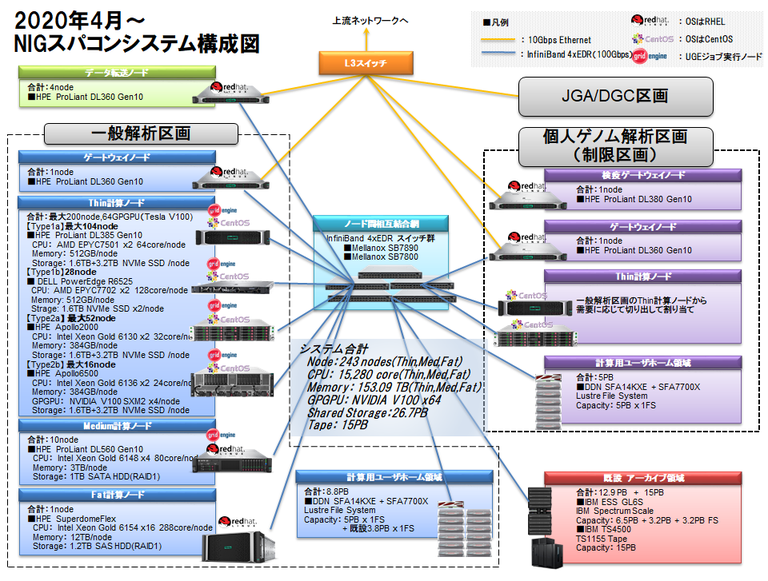

The NIG supercomputer system started its fifth phase of operation in March 2019.

The system is intended be used as a computational infrastructure for the construction of the international nucleotide sequence database, and will also be provided to a wide range of researchers both inside and outside the university as a computational infrastructure for research and education in the life sciences, with a focus on genetics, to strengthen the foundation of life and medical research in Japan and contribute to the development of new academic research.

- The system consists of two sections: a general analysis section and a personal genome analysis section. The personal genome analysis section is a paid service that meets high security standards. (In principle, the NIG supercomputer can be used free of charge, but some additional services are available for a fee. [Click here for details](/application/billing_service).

- We are operating the Singularity container to facilitate the installation of genome analysis software and to ensure the reproducibility of the analysis. Currently, more than 2,000 types of genome analysis software are available in the Singularity container.

- For the operation and analysis of life and medical databases, including the international nucleotide sequence database, we have a large storage system with a total capacity of 46.8PB, which enables us to transfer a large amount of data to and from Japan via a high-speed network.

