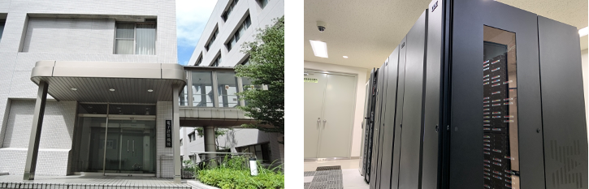

The National Institute of Genetics (NIG) provides state-of-the-art supercomputer system services equipped with large-scale clustered computers, large-scale memory-sharing computers, and large-capacity high-speed disk drives as a computational infrastructure for life and medical research.





Due to disk space constraints, we do not back up the data in the user home directory. It is the responsibility of the user to back up the data in their own computing environment.
<div className="clearfix"></div>


## Recent News

- [Added the power consumption page](/en/blog/2022-09-02-news_PowerConsumption) (2022.09.02)
- &#x26A0;[Renewal of application system for use](/en/blog/2022-07-05-news_NewApp) (Update 2022.07.05)
- [300TB more storage for analysis of Luster8](/en/blog/2022-07-05-Lustre8_300TB_add) (2022.07.05)
- &#x26A0;[Suspend acceptance of application for new use for large-scale storage](/en/blog/2022-05-13-suspension-of-applications) (2022.05.13)
- &#x1F9EC; [Added the introduction page of PortablePipeline developed by Professor Yoshitake of the University of Tokyo](/en/blog/2022-05-10-news_PortablePipeline) (2022.05.10)
- &#x2714; [Reducesed DDBJ Group Cloud fees](/blog/2022-04-05-news_DGC) (2022.04.05)
- [Added gateway nodes](/en/blog/2022-03-16-gateway) (2022.03.17)

## May 13, 2022(Friday) - Suspend acceptance of application for new use for the personal genome section and  large-scale storage on the general analysis section 

Thank you very much for using the NIG supercomputer.

Due to the computing resources of CPU and Disk are current very tight, we suspend application for new use for the following users.

- Application for new use using large-scale for the general analysis section
- Application for new use of personal genome analysis section users

The following applications will be accepted as before.

- For current alreay large-scale users for the general analysis section and the personal genome analysis section users, we will continue to accept additions of resources to chang the usage plan table as before.
- Regular user registration for the general analysis section will also be accepted as before. In this case, the disk memory will be limited to the default setting of 1TB.
- For using of the service for workshops, etc.

Thank you for your understanding that we may not be able to meet your request in such cases.

The timing for resuming application for new use will be decided by checking the availability of computer resources.
The availability forecast for each 4 month period will be posted on the website as needed. When you plan to use it, refer to the outlook for availability and submit your usage plan in advance.
However, please note that availability is not guaranteed and we may not be able to meet your request.


## Scheduled maintenance in 2022

In FY2022, we plan to perform scheduled maintenance twice.

- (Ended) June 28, 09:00 - July 1, 2022, 00:00(24h)
- December 2 - next Thursday (prediction)


## About Acknowledgements


The activities of the NIG Supercomputer System are evaluated by your acknowledgments. If your paper using our supercomputer system is accepted, please write your acknowledgments by referring to the following example.

Example

```
==============================================

　　Computations were partially performed on the NIG supercomputer
　　at ROIS National Institute of Genetics.

==============================================
```
