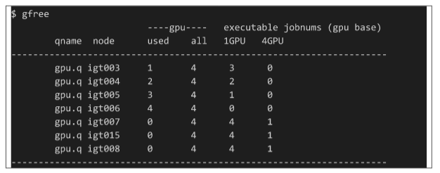

## Description of the `gfree` command

The NIG supercomputer provides a command `gfree` to list the usage status of GPU node.

The description of the output is as follows.

<table>
<tr>
	<th width="300">Item</th><th width="300">Description</th>
</tr>
<tr>
	<td>qname</td><td>queue name</td>
</tr>
<tr>
    <td>node</td><td>node name</td>
</tr>
<tr>
	<td>used</td><td>Number of GPU slots currently used</td>
</tr>
<tr>
	<td>all</td><td>Number of GPU slots mounted on the node</td>
</tr>
<tr>
	<td>executable jobnums</td><td>Number of executable jobs per number of requested GPU slots (1 GPU, 4 GPU)</td>
</tr>
</table>

On GPU nodes, the number of GPU slots is the number of GPUs. Each GPU node has 4 GPUs.

