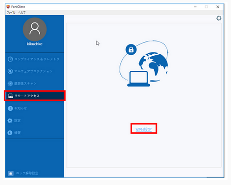
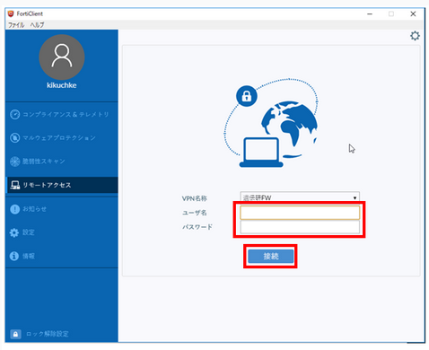
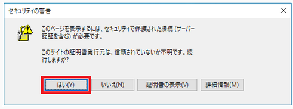
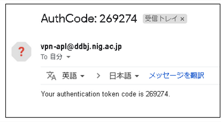

## Introduction

SSL-VPN connection is used for login and file transfer to the personal genome analysis section of the NIG supercomputer. For SSL-VPN connection, dedicated software called SSL-VPN Client software must be installed on the user's client machine. Two-factor authentication is used for SSL-VPN connection. For the purpose of improving security, the client machine is set to block access to the Internet when it is connected using SSL-VPN. At this time, communication within the local network to which the client machine belongs is not blocked. Therefore, for example, if the client machine is connected to a file server in the local network, it is possible to send data from that file server to the personal genome analysis section without any problem. On the other hand, if you are working by connecting to the client machine with ssh from outside the local network, the ssh connection will be cut off.

But it is possible to use only HTTPS on the Internet from the personal genome analysis section due to the settings on the firewall of the NIG supercomputer.


The outline of the connection procedure is shown in the figure below.


## Installing FortiClient VPN Client software


### Windows

1. Click the URL below. You can see the FortiClient official website page. On that page, click "Product Downloads" and then "FortiClient VPN only" as shown below.
	-  ForiClient official site: [https://www.forticlient.com/downloads](https://www.forticlient.com/downloads)


2. Download the installation program of FortiClient VPN installer for Windows.


3. Run the installation program saved in the download folder.
If "User Account Control" is displayed, select "Yes" to allow it.


4. Check the box for "Yes, I have read and accept the" and click "Next".


5. Select the set-up type of the user's computer. The type to select depends on whether virus checking software is installed on the user's computer or not.

Notes.
- Always ensure that the checkboxes are ticked as shown in the image below.
- If other unchecked items are ticked, the system may not work properly.

【If virus checking software is installed on the user's computer】

Ensure "Secure Remote Access" is checked on the "Choose Setup Type" screen and click "Next".


【If virus checking software is not installed on the user's computer】

Ensure "Secure Remote Access", "Additional Security Features" and "AntiVirus" are checked on the "Choose Setup Type" screen and click "Next".


6. On the "Destination Folder" screen, just click "Next". *Normally, no changes are required.


7. Click "install". Installation will start.


8. Click 'Finish'. Installation is completed.


### Mac

1. Click the URL below. You can see the FortiClient official website page. On that page, click "Product Downloads" and then "FortiClient VPN only" as shown below.
	- ForiClient official site: [https://www.forticlient.com/downloads](https://www.forticlient.com/downloads)


2. Download the FortiClient VPN installer for Mac.


3. Click "OK" to run it.


4. Double click on "FortiClientUpdate".


CLick "Open".


Downloading will start. Please wait for a minute.


Click "install".


Click "Continue".


Click "Continue".


5. Select the installing type of the user's computer. The type to select depends on whether virus checking software is installed on the user's computer or not.

【If the user's computer has virus checking software】

Click "Install".


【If the user's computer does not have virus checking software】

Click "Customize".


 
Under "Package name", check "Secure Remote Access" and "AntiVirus" and click "Install".

Notes.
- Always ensure that the checkboxes are ticked as shown in the image below.
- If other unchecked items are ticked, the system may not work properly.


6. Click "Close". Installation is completed.


### Linux

If using Linux or Windows Subsystem for Linux 2(WSL2), you can access the VPN by using the CUI openfortivpn.

1. Install openfortivpn package.

Install the SSL-VPN client software openfortivpn.

Example 1: Installing on centOS

Install openfortivpn from the RPMs -> x86_64 link on the following page.

[https://koji.fedoraproject.org/koji/buildinfo?buildID=1821936](https://koji.fedoraproject.org/koji/buildinfo?buildID=1821936)(latest version as of 10.Dec.2021)

```
$ sudo yum -y install
https://kojipkgs.fedoraproject.org//packages/openfortivpn/1.17.0/3.el7/x86_64/op
enfortivpn-1.17.0-3.el7.x86_64.rpm
```


Ensure that it has been installed.
```
$ sudo openfortivpn --version
1.17.0
```

Example 2: Installing on Ubuntu

Execute the following command to install openfortivpn.

```
$ sudo apt-get install -y openfortivpn
```

Ensure that it has been installed.
```
$ sudo openfortivpn --version
1.6.0
```


2. creating a configuration file

Save a configuration file with the following content: configration file name and location are optional.

For username and password, enter the VPN account information obtained in advance.

For trusted-cert, the following fixed value (hash value of the SSL-VPN server's certificate) must be specified.

```
$ sudo vi /path/to/config
host = 133.39.24.254
port = 443
username = ********
password = ********
trusted-cert = 860101b1dbaff15fa35da3f6ed643b3cae434234c9bd866d86f67948d07a7f94
```


## How to connect to the VPN 

### Windows or Mac (FortiClient GUI)


1. Configuring SSL-VPN client setting

1.1. Start FortiClient, select Remote Access from the menu and click "VPN Setting".




1.2. On the New VPN Connection screen, enter the information as shown in the table below and click 'Save'.

<table>
<tr>
	<td>VPN</td><td> Select "SSL-VPN"</td>
</tr>
<tr>
	<td>Connection name</td><td>Any string</td>.
</tr>
<tr>
	<td>Remote GW</td><td>133.39.24.254</td>
</tr>
<tr>
	<td>Port number</td><td>443 (check box r)</td>
</tr>
<tr>
	<td>Authentication</td><td>Select "Enter username"</td>.
</tr>
</table>


2. Connecting to VPN

2.1. You should be asked for your credentials. Enter a username and password.

 

If you use Mac, a further message "Validate certificate" is displayed as follows.


Click "Continue"


2.2. If you see a Security Alert pop-up message, click Yes. 



2.3. A one-time password will be sent to the email address linked to the SSL-VPN account as follows.



If the message is not sent, see [FAQ:Login > FAQ(Login)](/faq/faq_login/#個人ゲノム解析区画に対してssl-vpn接続を行うためにforticlientにユーザ名をパスワードを入力してもvpnアカウントに紐付くメールアドレスへワンタイムパスワードが送られてきません).

- Windows

Enter the one-time password (269274 in the example above) in the "Token" field and click "OK".


- Mac

Enter the one-time password (269274 in the example above) in "Answer" and click "OK".


2.4. When the following screen appears, VPN connection is established.


### Linux (openfortivpn CUI)

1. Configuring SSL-VPN client setting

Save a configuration file with the following content: configration file name and location are optional.

For username and password, enter the VPN account information obtained in advance.

For trusted-cert, the following fixed value (hash value of the SSL-VPN server's certificate) must be specified.

```
$ sudo vi /path/to/config
host = 133.39.24.254
port = 443
username = ********
password = ********
trusted-cert = 860101b1dbaff15fa35da3f6ed643b3cae434234c9bd866d86f67948d07a7f94
```

2. Executing commands for VPN connection

Specify the configuration file as an argument and execute the command as follows.

```
$ sudo openfortivpn -c /path/to/config
```

2.3. After executing the command, a one-time password will be sent to the email address linked to the SSL-VPN account as follows.


If the message is not sent, see [FAQ:Login > FAQ(Login)](/faq/faq_login/#個人ゲノム解析区画に対してssl-vpn接続を行うためにforticlientにユーザ名をパスワードを入力してもvpnアカウントに紐付くメールアドレスへワンタイムパスワードが送られてきません).


Enter the one-time password (269274 in the example above) interactively as shown below and press the Enter key.

```
$ sudo openfortivpn -c /path/to/config
INFO: Connected to gateway.
Two-factor authentication token: Enter the ont-time password and press the Enter key
```

When the one-time password authentication is successful, the log is displayed as follows. When the following log is displayed, VPN connection is established. At this point, no prompt is returned. VPN connection will be disconnected by pressing Ctrl+C.

```
$ sudo openfortivpn -c config
INFO: Connected to gateway.
Two-factor authentication token:
INFO: Authenticated.
INFO: Remote gateway has allocated a VPN.
Using interface ppp0
Connect: ppp0 <--> /dev/pts/1
INFO: Got addresses: [10.212.134.11], ns [133.39.221.65, 133.39.222.41]
INFO: negotiation complete
INFO: negotiation complete
local IP address 10.212.134.11
remote IP address 192.0.2.1
INFO: Interface ppp0 is UP.
INFO: Setting new routes...
INFO: Adding VPN nameservers...
INFO: Tunnel is up and running.
```


## Logging in to the gateway using SSH

After connecting to the SSL-VPN, launch a terminal emulator and execute the following command to log in to the gateway of the personal genome analysis section.

```
ssh [username]@gwa.ddbj.nig.ac.jp 
```


## Logging in to the analysis server using SSH

The personal genome analysis section is a node rental, so the user logs in to the borrowed node by SSH from the gateway.
The name of the relevant node will be provided at the start of use.
