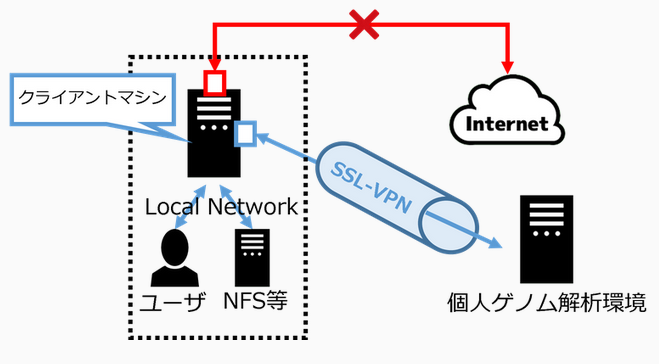

import Marker from '@site/src/components/Marker';

## Introduction

SSL-VPN connection is used for login and file transfer to the personal genome analysis division of the NIG supercomputer. For SSL-VPN connection, dedicated software called SSL-VPN Client software must be installed on the user's client machine. Two-factor authentication is used for SSL-VPN connection. For the purpose of improving security, the client machine is set to block access to the Internet when it is connected using SSL-VPN. At this time, communication within the local network to which the client machine belongs is not blocked. Therefore, for example, if the client machine is connected to a file server in the local network, it is possible to send data from that file server to the personal genome analysis division without any problem. On the other hand, if you are working by connecting to the client machine with ssh from outside the local network, the ssh connection will be cut off.

But it is possible to use only HTTPS on the Internet from the personal genome analysis division due to the settings on the firewall of the NIG supercomputer.





## How to log in to the Personal Genome Analysis Division

The outline of the connection procedure is shown in the figure below.


### <Marker color="#3FCBE7">Log in to FortiClient and start the SSL-VPN connection.</Marker>

#### STEP 1. Installing FortiClient VPN Client software


Download and install FortiClient on the official website of "[&#x1f517;<u>FortiClient</u>](https://www.fortinet.com/support/product-downloads)".

- The Official Website：&#x1f517;<u>https://www.fortinet.com/support/product-downloads</u>

For more information on how to download and install it, see the links below.

- [<u>Installing FortiClient VPN Client software (Windows)</u>](/personal_genome_division/pg_login_ssl-vpn_install_win)
- [<u>Installing FortiClient VPN Client software (MacOS)</u>](/personal_genome_division/pg_login_ssl-vpn_install_mac)
- [<u>Installing FortiClient VPN Client software (Linux)</u>](/personal_genome_division/pg_login_ssl-vpn_install_linux)


#### STEP 2. Connecting to the VPN 

You should connect to the SSL-VPN before logging in to the prsonal genome analysis division.

For more information on how to connect, see the following link.
- [<u>How to connect to the VPN (Windows)</u>](/personal_genome_division/pg_login_ssl-vpn_connection_win)
- [<u>How to connect to the VPN (MacOS)</u>](/personal_genome_division/pg_login_ssl-vpn_connection_mac)
- [<u>How to connect to the VPN (Linux)</u>](/personal_genome_division/pg_login_ssl-vpn_connection_linux)

If you have trouble connecting, refer to [<u>FAQ</u>](/faq/faq_login_personal#dialogbox_disappear).

### <Marker color="#3FCBE7">Log in to the gateway via ssh connection.</Marker>

#### STEP 3. SSH log in to the gateway

After connecting to the SSL-VPN, launch a terminal emulator and execute the following command to log in to the gateway of the personal genome analysis division.

There are two gateway nodes, `gwa.ddbj.nig.ac.jp` and `gwa2.ddbj.nig.ac.jp`. You can log in by executing the following commands, respectively.

```
ssh [username]@gwa.ddbj.nig.ac.jp 
```

or

```
ssh [username]@gwa2.ddbj.nig.ac.jp 
```

For questions on how to login, Refer to [<u>FAQ</u>](/faq/faq_login_personal).


## Logging in to the analysis server using SSH

The personal genome analysis division is a node rental, so the user logs in to the borrowed node by SSH from the gateway.
The name of the relevant node will be provided at the start of use.

