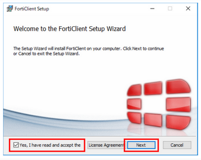
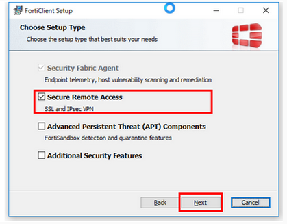
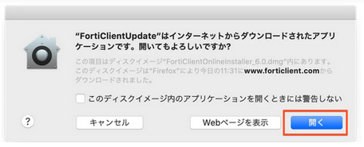
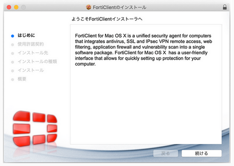
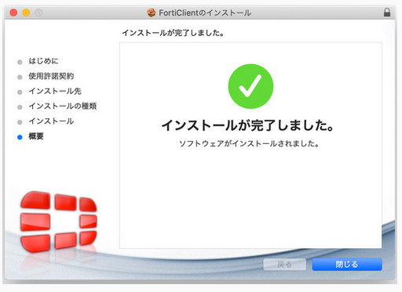
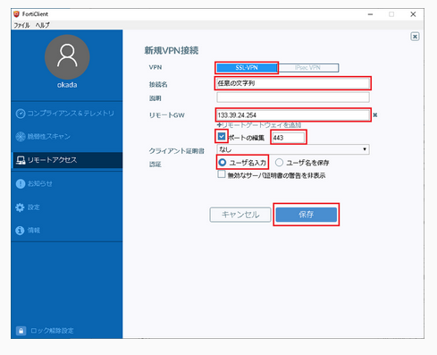
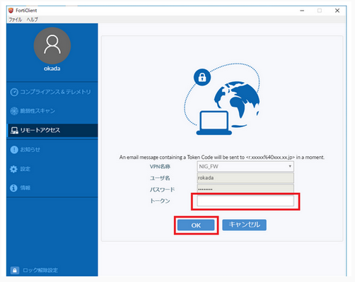
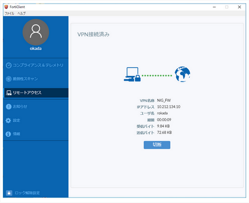

## 概要

遺伝研スパコンの個人ゲノム解析環境へのログイン及びファイル転送にはSSL-VPN接続を用います。SSL-VPN接続を行うためにはユーザーのクライアントマシンに専用のソフトウェアをインストールする必要があります。

SSL-VPN接続の際は二要素認証が行われます。セキュリティー向上の目的で、SSL-VPNで接続している時にはクライアントマシンのインターネットへのアクセスは遮断される設定としています。このとき、クライアントマシンが属するローカルネットワーク内への通信は遮断されません。したがって例えばクライアントマシンがローカルネットワーク内のファイルサーバーに接続されていて、そのファイルサーバーからデータを個人ゲノム解析環境に送るといった操作は問題なく可能です。一方、ローカルネットワークの外側からsshでクライアントマシンに接続して作業を行っていた場合はそのssh接続は遮断されるので注意が必要です。


接続の手順の概要は以下の図のとおりです。


## VPNクライアントのインストール 


### Windowsの場合
1. [ForiClientの公式サイト](https://www.forticlient.com/downloads)からWindows版のアプリをインストールする。


2. ダウンロードフォルダに保存されたインストールプログラムを実行します。
ユーザアカウント制御は「はい」で進んでください。


3. 「Yes, I have read and accept the」にチェックを付け、「Next」をクリックします。



4. クライアントマシンにウィルスチェックソフトが入っているか否かで手順が異なります。

【クライアントマシンにウイルスチェックソフトが入っている場合】

Choose Setup Typeで「Secure Remote Access」にチェックが入っていることを確認し、「Next」をクリックします。

必ず下記のスクリーンショットの通りにチェックされていることを確認してください。

その他の項目にチェックが入っていると、正常に動作しない恐れがあります。



【クライアントマシンにウイルスチェックソフトが入っていない場合】

Choose Setup Typeで「Secure Remote Access」と「Additional Security Features」と「AntiVirus」にチェックが入っていることを確認し、「Next」をクリックします。

必ず下記のスクリーンショットの通りにチェックされていることを確認してください。

その他の項目にチェックが入っていると、正常に動作しない恐れがあります。


5. Destination Folderではそのまま「Next」をクリックします。※通常、変更は不要です。


6. 「install」をクリックするとインストールが開始されます。


7. 「Finish」をクリックするとインストール完了となります。


### Macの場合

1. [ForiClientの公式サイト](https://www.forticlient.com/downloads)からアプリをインストールします。Macバージョンのインストーラをダウンロードします。


2. ダウンロードしたインストーラを実行します。OKを押してください。


3. FortiClientUpdateをダブルクリックします。


[開く]を押します。



ダウンロードが始まります。このまましばらくお待ち下さい。


[install]を押します。


[続ける]を押します。



[続ける]を押します。


4. 以下、クライアントマシンにウィルスチェックソフトが入っているか否かで手順が異なります。

【クライアントマシンにウイルスチェックソフトが入っている場合】

そのまま[インストール]を押します。


【クライアントマシンにウイルスチェックソフトが入っていない場合】

[カスタマイズ]を押します。


 

以下の通り、「Secure Remote Access」と「AntiVirus」にチェックを入れます。

必ず以下のスクリーンショット通りのチェックとなっているか確認してください。

その他の項目にチェックが入っていると正常に動作しない恐れがあります。


5. [閉じる]を押します。




### Linuxの場合

Linuxの場合やWindows Subsystem for Linux 2(WSL2)を使う場合はCUIのopenfortivpnを使うことでVPNにアクセスできます。

1. openfortivpnパッケージをインストール

SSL-VPNクライアントソフトopenfortivpnをインストールします。

例) centOSにインストール
下記ページの RPMs -> x86_64 のリンクからopenfortivpnをインストールします。

[https://koji.fedoraproject.org/koji/buildinfo?buildID=1418024](https://koji.fedoraproject.org/koji/buildinfo?buildID=1418024)(2020.06.03時点 最新版)

```
$ sudo yum -y install
https://kojipkgs.fedoraproject.org//packages/openfortivpn/1.11.0/1.el7/x86_64/op
enfortivpn-1.11.0-1.el7.x86_64.rpm
```


インストールされたことの確認
```
$ sudo openfortivpn --version
1.11.0
```

例) Ubuntuにインストール
```
$ sudo apt-get install -y openfortivpn
```

インストールされたことの確認
```
$ sudo openfortivpn --version
1.6.0
```


2. 設定ファイル作成

configファイルを以下の内容で保存します。configファイルの名前、配置場所は任意です。

usernameとpasswordには事前に取得したVPNアカウント情報を入力ください。

trusted-certには、以下の固定値(SSL-VPNサーバの証明書のハッシュ値)を指定する必要があります。
```
$ sudo vi /path/to/config
host = 133.39.24.254
port = 443
username = ********
password = ********
trusted-cert = 860101b1dbaff15fa35da3f6ed643b3cae434234c9bd866d86f67948d07a7f94
```


## VPNへの接続方法 

### WindowsまたはMacの場合 (FortiClient GUI)

1. SSL-VPNクライアントの設定

1.1. FortiClientを起動し、メニューからリモートアクセスを選択し、[VPN設定]をクリックします。


1.2. 新規VPN接続画面にて下表の通り入力し、「保存」をクリックします。

<table>
<tr>
	<td>VPN</td><td>「SSL-VPN」を選択</td>
</tr>
<tr>
	<td>接続名</td><td>任意の文字列</td>
</tr>
<tr>
	<td>リモートGW</td><td>133.39.24.254</td>
</tr>
<tr>
	<td>ポート番号</td><td>443(チェックボックスrにチェックを入れる)</td>
</tr>
<tr>
	<td>認証</td><td>「ユーザ名入力」を選択</td>
</tr>
</table>



2. SSL-VPNへの接続

2.1. ユーザ名とパスワードを入力します。

 

Macの場合は、さらに以下のように[証明書を検証]というメッセージが表示されます。

[続ける]を押します。


2.2. セキュリティの警告は「はい」を押します。


2.3. SSL-VPNアカウントに紐付くメールアドレスへ以下のようなワンタイムパスワードが送信されます。


送信されない場合は、[FAQ:Login > FAQ(ログインについて)](/faq/faq_login#個人ゲノム解析区画に対してssl-vpn接続を行うためにforticlientにユーザ名をパスワードを入力してもvpnアカウントに紐付くメールアドレスへワンタイムパスワードが送られてきません)をご参照ください。

- Windowsの場合

「トークン」へワンタイムパスワード(上記の例の場合、269274)を入力し、「OK」をクリックします。



- Macの場合

[答え]にワンタイムパスワード(上記の例の場合、269274)を入力し、[OK]を押します。


2.4. 以下の画面となり、VPN接続中となります。




### Linuxの場合 (openfortivpn CUI)

1. 設定ファイル作成

configファイルを以下の内容で保存します。configファイルの名前、配置場所は任意です。

usernameとpasswordには事前に取得したVPNアカウント情報を入力ください。

trusted-certには、以下の固定値(SSL-VPNサーバの証明書のハッシュ値)を指定する必要があります。
```
$ sudo vi /path/to/config
host = 133.39.24.254
port = 443
username = ********
password = ********
trusted-cert = 860101b1dbaff15fa35da3f6ed643b3cae434234c9bd866d86f67948d07a7f94
```

2. VPN接続コマンド実行

設定ファイルを引数に指定して下記の通りコマンドを実行します。
```
$ sudo openfortivpn -c /path/to/config
```

コマンドを実行すると、VPNアカウントに紐付くメールアドレスへワンタイムパスワードが送信されます。

送信されない場合は、[FAQ:Login > FAQ(ログインについて)](/faq/faq_login#個人ゲノム解析区画に対してssl-vpn接続を行うためにforticlientにユーザ名をパスワードを入力してもvpnアカウントに紐付くメールアドレスへワンタイムパスワードが送られてきません)をご参照ください。


以下の通り対話式でワンタイムパスワード(上記の例の場合、269274)を入力し、Enterキーを押してください。
```
$ sudo openfortivpn -c /path/to/config
INFO: Connected to gateway.
Two-factor authentication token:ワンタイムパスワードを入力し、Enter
```

ワンタイムパスワード認証に成功し、下記の通りログが表示されればVPN接続状態となります。
```
$ sudo openfortivpn -c config
INFO: Connected to gateway.
Two-factor authentication token:
INFO: Authenticated.
INFO: Remote gateway has allocated a VPN.
Using interface ppp0
Connect: ppp0 <--> /dev/pts/1
INFO: Got addresses: [10.212.134.11], ns [133.39.221.65, 133.39.222.41]
INFO: negotiation complete
INFO: negotiation complete
local IP address 10.212.134.11
remote IP address 192.0.2.1
INFO: Interface ppp0 is UP.
INFO: Setting new routes...
INFO: Adding VPN nameservers...
INFO: Tunnel is up and running.
```
プロンプトが返ってこない状態となります。（Ctrl+Cを押すことでVPN接続状態が解除されます。）


## SSHによるゲートウェイへのログイン

SSL-VPN接続状態を保持したままで、ターミナルエミュレータを立ち上げ、
以下のようにコマンドを実行すると個人ゲノム解析環境のゲートウェイにログインできます。

```
ssh [ユーザ名]@gwa.ddbj.nig.ac.jp 
```


## SSHによる解析サーバへのログイン

個人ゲノム解析区画はノード貸しなので、ユーザーの借りたノードにはゲートウェイ上からSSHすることによりログインします。
該当のノードの名前は利用開始時にお知らせします。

