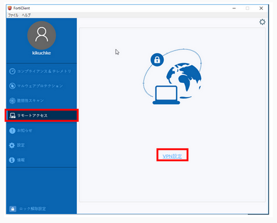
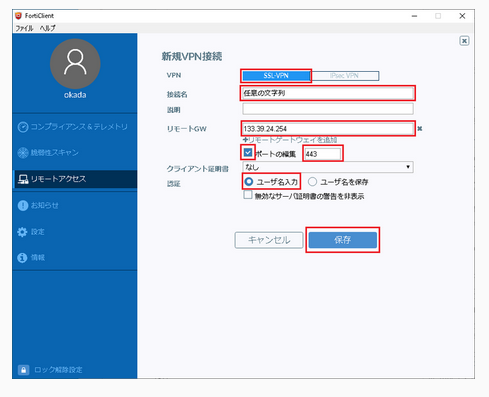

For Wondows, use the FortiClient GUI to configure the SSL-VPN client.

1. Start FortiClient, select Remote Access from the menu and click "VPN Setting".

2. On the New VPN Connection screen, enter the information as shown in the table below and click 'Save'.

<table>
<tr>
	<td>VPN</td><td> Select "SSL-VPN"</td>
</tr>
<tr>
	<td>Connection name</td><td>Any string</td>.
</tr>
<tr>
	<td>Remote GW</td><td>133.39.24.254</td>
</tr>
<tr>
	<td>Port number</td><td>443 (check box r)</td>
</tr>
<tr>
	<td>Authentication</td><td>Select "Enter username"</td>.
</tr>
</table>

