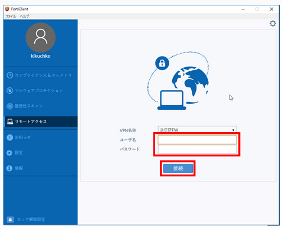
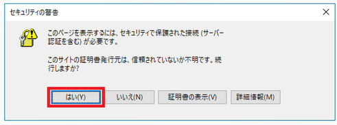
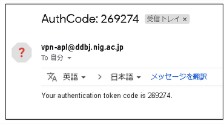
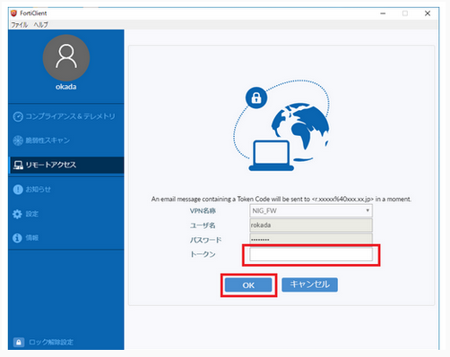
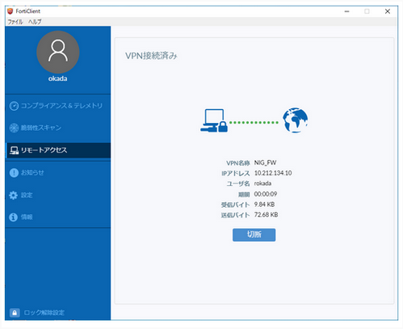

For Windows, connect using the FortiClient GUI.

1. Enter a username and password.

 

2. If you see a Security Alert pop-up message, click Yes. 

A one-time password will be sent to the email address linked to the SSL-VPN account as follows.

If the message is not sent, see [FAQ:Login > FAQ(Login)](/faq/faq_login_personal/#🆀-what-to-do-if-you-cannot-log-in-to-the-nig-supercomputer-via-ssh).

- Windows

3. Enter the one-time password (269274 in the example above) in the "Token" field and click "OK".

4. When the following screen appears, VPN connection is established.

