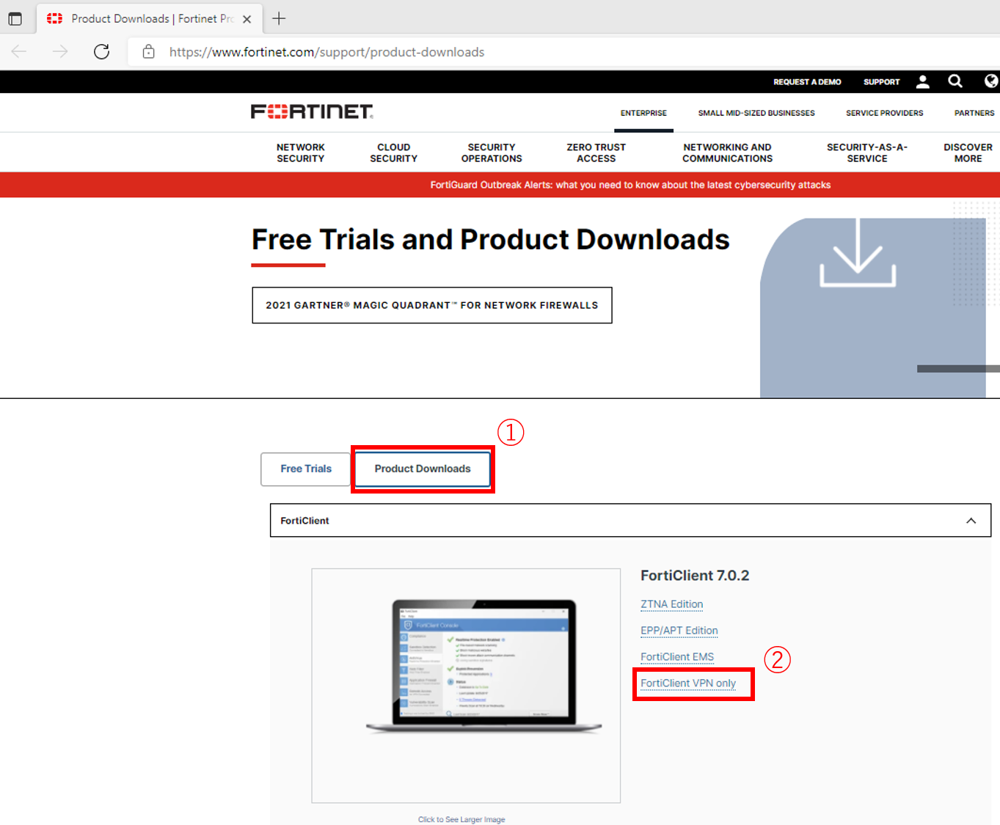
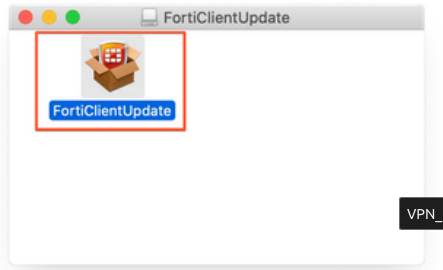
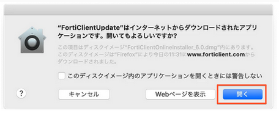
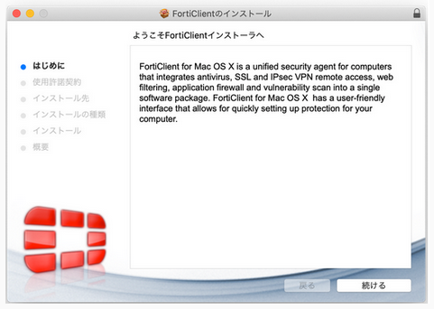
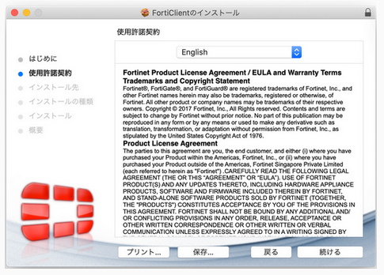
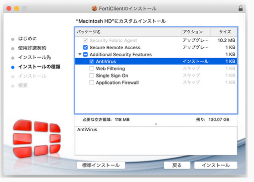
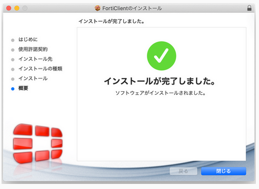

## Download the VPN service "FortiClient"

1. Click the URL below. You can see the FortiClient official website page. On that page, click "Product Downloads" and then "FortiClient VPN only" as shown below.
	-  ForiClient official site: [&#x1f517;<u>https://www.fortinet.com/support/product-downloads</u>](https://www.fortinet.com/support/product-downloads)

2. Download the FortiClient VPN installer installation programme for MacOS by clicking ① and ② as shown below.

## Install the VPN service "FortiClient"

1. Click "OK" to run it.

2. Double click on "FortiClientUpdate".

3. CLick "Open".

Downloading will be started. Please wait for a minute.

4. Click "install".

5. Click "Continue".

6. Click "Continue".

7. Select the installing type of the user's computer. 

The type to select depends on whether virus checking software is installed on the user's computer or not.

Notes.
- **Ensure that the checkboxes are ticked as shown in the image below.**
- **If other unchecked items are ticked, the system may not work properly.**

【If the user's computer has virus checking software】

Click "Install".

【If the user's computer does not have virus checking software】

Click "Customize".

 
Under "Package name", check "Secure Remote Access" and "AntiVirus" and click "Install".

8. Click "Close". Installation is completed.

