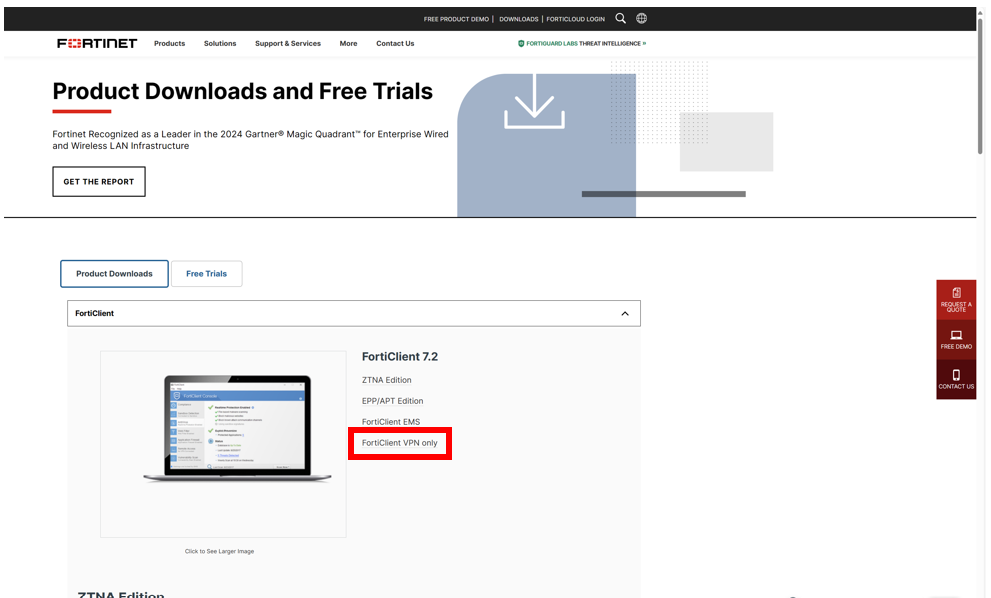
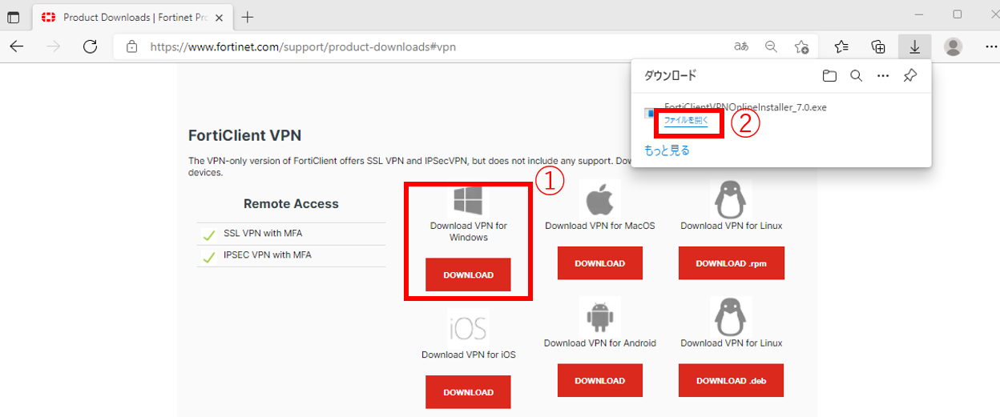
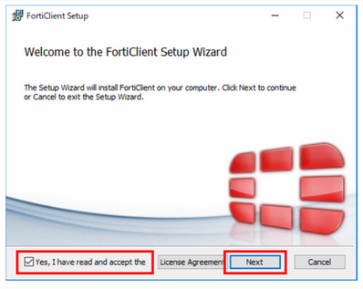
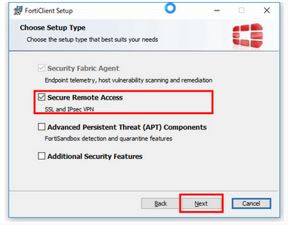
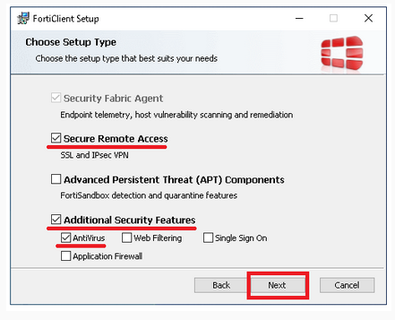
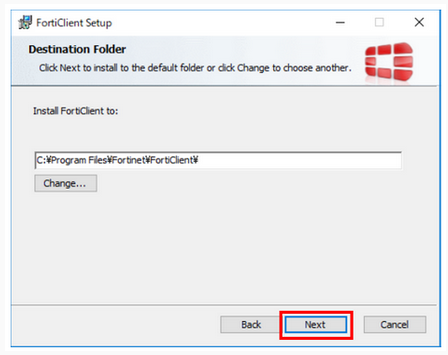
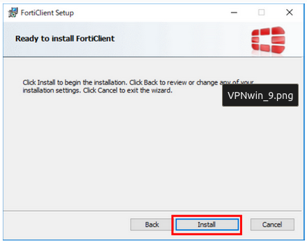
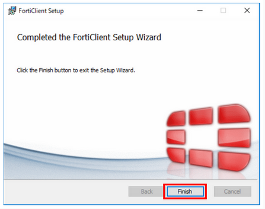

## Download the VPN service "FortiClient"

1. Click the URL below. You can see the FortiClient official website page. On that page, click "Product Downloads" and then "FortiClient VPN only" as shown below.
	-  ForiClient official site: [&#x1f517;<u>https://www.fortinet.com/support/product-downloads</u>](https://www.fortinet.com/support/product-downloads)

2. Download the FortiClient VPN installer installation programme for Windows by clicking ① and ② as shown below.

##  Install the VPN service "FortiClient"

1. Run the installation program saved in the download folder.
If "User Account Control" is displayed, select "Yes" to allow it.

2. Check the box for "Yes, I have read and accept the" and click "Next".

3. Select the set-up type of the user's computer. 

The type to select depends on whether virus checking software is installed on the user's computer or not.

Notes.
- **Ensure that the checkboxes are ticked as shown in the image below.**
- **If other unchecked items are ticked, the system may not work properly.**

【If virus checking software is installed on the user's computer】

Ensure "Secure Remote Access" is checked on the "Choose Setup Type" screen and click "Next".

【If virus checking software is not installed on the user's computer】

Ensure "Secure Remote Access", "Additional Security Features" and "AntiVirus" are checked on the "Choose Setup Type" screen and click "Next".

4. On the "Destination Folder" screen, just click "Next". *Normally, no changes are required.

5. Click "install". Installation will be started.

6. Click 'Finish'. Installation is completed.

