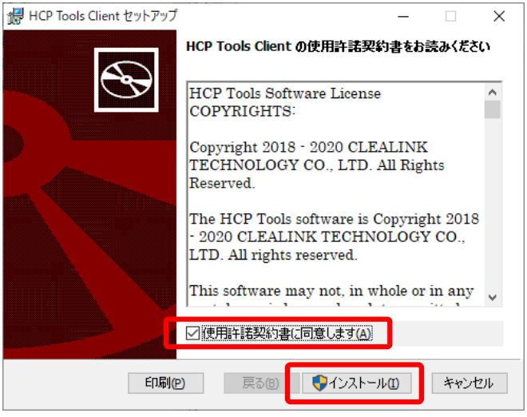

## Get the installer

Download the HCP tools client software installer from the following link.

- <a href="https://github.com/oogasawa/Ptools/raw/main/1.3.0R-45/Windows/HCP_Tools_Client.msi">HCP_Tools_Client.msi</a>
- <a href="https://github.com/oogasawa/Ptools/tree/main/1.3.0R-45/Windows">HCP_Tools_Client.md5sum</a>

If you need past versions and others, <a href="https://github.com/oogasawa/Ptools">you can download here</a>.


## Installing the HCP tools client software

Double click `HCP_Tools_Client.msi`.


Check the box "I accept the license agreement(A)" and click "Install(I)".



Click "Yes" to the permission to change the device.
Installation will start.


When installation is complete, the following screen will be displayed on the screen. Click "Finish(F)".


After installation, make sure that the run command exists under `C:\Program Files` and the configuration file exists under `C:\ProgramData`.

- The run command : 'C:\Program Files\Clealink\HCP Tools\hcp.exe'
- The configuration file: 'C:\ProgramData\Clealink\HCP Tools\hcp.conf'

## Location the configuration file


HCP tools refers to the configuration file in the `_hcp` directory directly under the user directory (`C:\Users\your_name`) when you use Windows as the OS of the user's client computer.

When you run the following command in the Windows PowerShell, you can copy the configuration file template.

```bash
mkdir C:\Users\your_name\_hcp
cp "C:\ProgramData\Clealink\HCP Tools\*.conf" C:\Users\your_name\.hcp
```


## Editing the configuration file

Locate the HCP tools configuration file in the user directory and add the public key settings for user authentication.

Procedure: [How to write the configuration file](/software/Archaea_tools/hcptools_conf)

