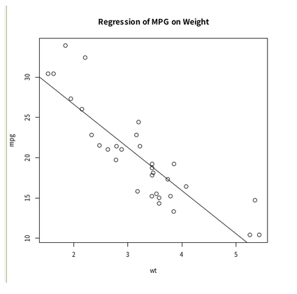

## Introduction

Singularity containers are available on the NIG supercomputer to install various analysis software with user permission.

By using Singularity, for example, it is possible to run analysis software installed by Ubuntu Linux apt-get etc. on the NIG supercomputer (CentOS 7.9).


## Reference

- [Singularity official website](https://singularity.hpcng.org/)


## Creating images with Singularity - The basic procedures

The Singularity container is generally used in the following procedure.

- (i) Create an analysis environment in sandbox mode on a local server with root privileges.
- (ii) singularity build it and create archive Singularity container image file (*.sif)
- (iii) Copy this file to a shared computer such as a supercomputer. 1
- (iv) Execute the program in the container with user permission on the supercomputer.

The container image file (*.sif) is originally write-protected to avoid security issues when the container is brought onto the shared computer.

Here's the example of using the Singularity Definition File.

First, create a Singularity container image file in the user's own Linux environment. (For information on installing Singularity itself, read the official page [Quick Start — Singularity container 3.5 documentation ](https://sylabs.io/guides/3.5/user-guide/quick_start.html).


```
# For example, clone the Singularity Definition File from the following site to the user's linux server.
git clone https://github.com/oogasawa/singularity-ubuntu18

# Build this Definition file to create a Singularity container image file.
# (For more information about building, See above README.md of the github repository)
cd singularity-ubuntu18
sudo apt-get debootstrap
sudo singularity build ubuntu18.sif Singularity
```

Copy the Singularity container image file created as described above onto the NIG supercomputer.

(Or, the above build process takes more than an hour, so build it in the background by registering it on the singularity-hub in advance, and download the Singularity container image file from the singularity-hub to the NIG supercomputer. )

Execute the following on the NIG supercomputer.

```
# Get the Singularity container image from singularity-hub
singularity pull shub://oogasawa/singularity-ubuntu18
# Set alias to prevent long commands
alias sing="singularity exec $HOME/ubuntu18.sif
# Use it
```


## Building images on the supercomputer : Generating Singularity images from Docker container images

You can use a Docker container instead of Singularity's sandbox mode. Using this method, you can build (create) a Singularity image on the supercomputer. (The Docker container image file must be registered in the Docker Hub in advance.)

The example of using Singularity with the Docker container image is as follows:

```
# Specify the amount of memory in advance when qlogin because the error saying there is not enough memory occurs when building singularity.
$ qlogin -l s_vmem=20G -l mem_req=20G
Your job 5083922 ("QLOGIN") has been submitted
waiting for interactive job to be scheduled ...
Your interactive job 5083922 has been successfully scheduled.
Establishing /home/geadmin/UGER/utilbin/lx-amd64/qlogin_wrapper
session to host at029 ...
Warning: Permanently added '[at029]:45682,[172.19.7.5]:45682' (ECDSA)
to the list of known hosts.
Last login: Sun Jan 26 20:55:09 2020 from gw1


# Singularity build the Docker container on Docker Hub with user permission.
$ singularity build lolcow.sif docker://godlovedc/lolcow
INFO:    Starting build...
Getting image source signatures
Skipping fetch of repeat blob
sha256:9fb6c798fa41e509b58bccc5c29654c3ff4648b608f5daa67c1aab6a7d02c118
Skipping fetch of repeat blob
sha256:3b61febd4aefe982e0cb9c696d415137384d1a01052b50a85aae46439e15e49a
Skipping fetch of repeat blob
sha256:9d99b9777eb02b8943c0e72d7a7baec5c782f8fd976825c9d3fb48b3101aacc2
Skipping fetch of repeat blob
sha256:d010c8cf75d7eb5d2504d5ffa0d19696e8d745a457dd8d28ec6dd41d3763617e
Skipping fetch of repeat blob
sha256:7fac07fb303e0589b9c23e6f49d5dc1ff9d6f3c8c88cabe768b430bdb47f03a9
Skipping fetch of repeat blob
sha256:8e860504ff1ee5dc7953672d128ce1e4aa4d8e3716eb39fe710b849c64b20945
Copying config sha256:73d5b1025fbfa138f2cacf45bbf3f61f7de891559fa25b28ab365c7d9c3cbd82
 3.33 KiB / 3.33 KiB [======================================================] 0s
Writing manifest to image destination
Storing signatures
INFO:    Creating SIF file...
INFO:    Build complete: lolcow.sif

# Execute the Singularity container
$ singularity run lolcow.sif
 ________________________________________
/ Don't let your mind wander -- it's too \
\ little to be let out alone.            /
 ----------------------------------------
        \ ^__^
         \ (oo)\_______
            (__)\ )\/\
                ||----w |
                || ||
o
```


## Use the Singularity image installed on the supercomputer

For reducing the time and effort of installing analysis software, there are more than 34,000 Singularity container image files provided by biocontainers under the /usr/local/biotools/ directory on the NIG supercomputer.
 

The usage example is as follows:
```
# It's good to set alias to prevent the command from becoming too long.
$ alias singR="singularity exec /usr/local/biotools/r/r-base:3.5.1 R"

$ singR --no-save < example.R
> attach(mtcars)
> plot(wt, mpg)
> abline(lm(mpg~wt))
> title("Regression of MPG on Weight")
>

```


(Citation) The above code example is based on the following website.


[R Tutorial For Beginners](https://www.statmethods.net/r-tutorial/index.html)

The execution result(Rplots.pdf)




