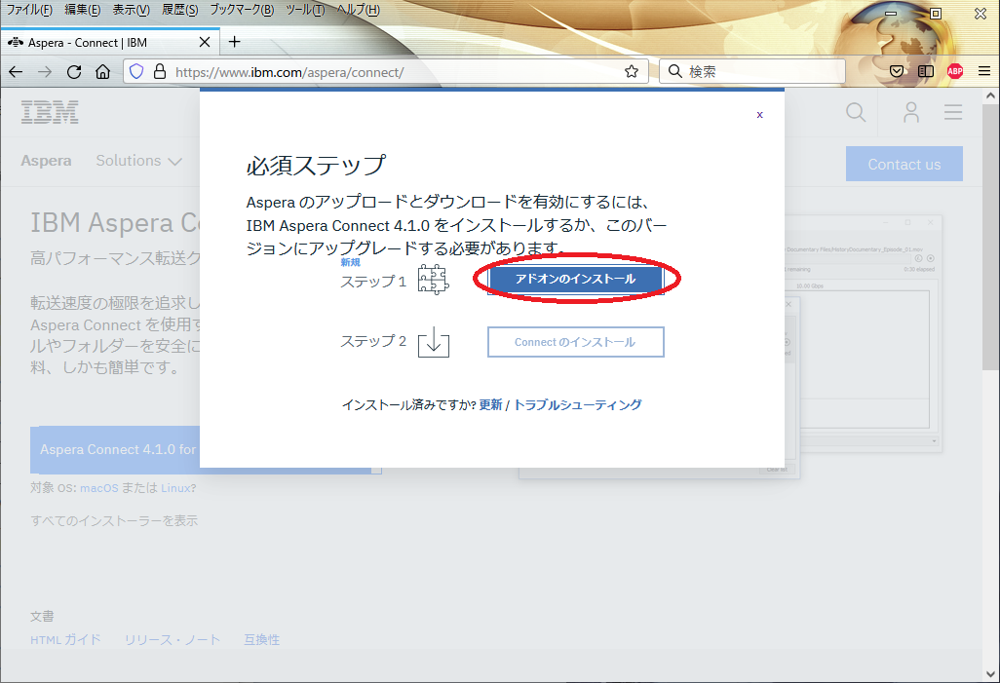
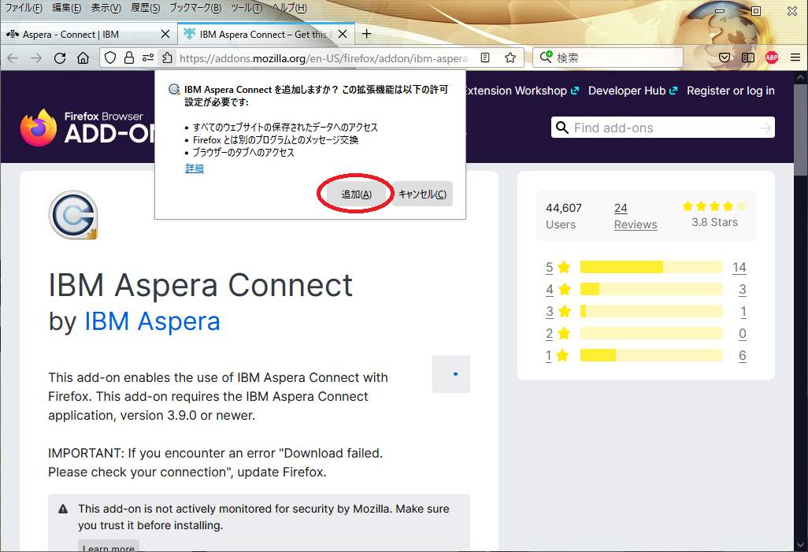

## Installing Aspera Connect transfer client software

There are a web interface version (aspera connect) and a command line interface version (`ascp`) of Aspera Connect transfer client software.
You need to install Aspera Connect transfer client software version 4 or later.

- Due to the combination of Aspera server and client versions, 3.9.x does not work on Mac, and does not work on Windows and Linux with private/public keys which no passphrase is specified.
- Note: You can't download the version 4 `ascp` command unless the Aspera connect web browser plug-in is installed. 


Procedure

1. Download the installer
2. Run the installer and adjustment the path of `ascp`


## Download the installer

The procedure is the same for Windows, Mac and Linux.


1, Open https://www.ibm.com/aspera/connect/ in your web browser and click on "Download Aspera Connect".


2, Click "Add extension" for Firefox or "Install Extension" for Chrome. 




3, Click "Add to Firefox" for Firefox or “Add to Chrome” for Chrome and install the IBM Aspera Connect add-on to your web browser. Click "Add". The “Add ‘IBM Aspera Connect?’” popup appears. Click "Add" for Firefox or "Add extension" fot Chrome. If successful, you will see the message “IBM Aspera Connect has been added to Firefox/Chrome”.





4, After Installing the installer, open https://www.ibm.com/aspera/connect/ in your web browser again and click "Download Aspera Coonect" You can download the installer.


## Run the installer and adjustment the path


### Using Windows or Mac as the OS of the cliant computer

For Windows and Mac, run the downloaded installer.
The path will also be set when you run it.


### Using Linux as the OS of the cliant computer

For Linux, follow the above steps, the file such as `ibm-aspera-connect_4.1.0.46-linux_x86_64.tar.gz` will be downloaded. Unzip and run it with bash. You can install it with user permission.

```
tar zxvf ibm-aspera-connect_4.1.0.46-linux_x86_64.tar.gz
bash ibm-aspera-connect_4.1.0.46-linux_x86_64.sh
```

When you run the installer, the executable file will be extracted under `$HOME/.aspera/connect/bin`, so pass the path here.

```
export PATH=$HOME/.aspera/connect/bin:$PATH
```


