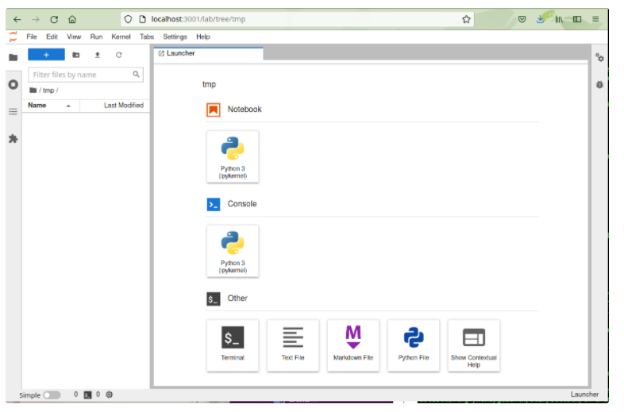

## Installing Jupyter Lab

If you have already installed Miniconda, you can install Juypter Lab with the following command.

` conda install -c conda-forge jupyterlab `

Generate a config file with the following command.

` jupyter server --generate-config `

Set a password with the following command.

` jupyter server --generate-config `


## Starting the Jupyter Lab server

First, check the local IP address of the interactive node assigned by qlogin.

```
$ ip a | grep ib0 
10: ib0: <BROADCAST,MULTICAST,UP,LOWER_UP> mtu 1500 qdisc mq state UP group default qlen 256 
 inet 172.19.7.186/20 brd 172.19.15.255 scope global ib0
``` 

In this case, it is 172.19.7.186.

Next, start the Juypter Lab server on the interactive node.

` $ jupyter lab --no-browser --ip "*" `

When it starts, you will get the following message at the end. (No prompt is returned. Leave it Leave it connected. Use Ctrl-C to exit.)

```
$ jupyter lab --no-browser --ip "*"
[I 2021-08-13 09:55:43.340 ServerApp] jupyterlab | extension was successfully linked.
[I 2021-08-13 09:55:43.707 ServerApp] nbclassic | extension was successfully linked.
[W 2021-08-13 09:55:44.145 ServerApp] WARNING: The Jupyter server is listening on all IP addresses and not using encryption. This is not recommended.
[I 2021-08-13 09:55:44.245 ServerApp] nbclassic | extension was successfully loaded.
...
[I 2021-08-13 09:55:44.250 ServerApp] Jupyter Server 1.10.2 is running at:
[I 2021-08-13 09:55:44.250 ServerApp] http://at139:8888/lab
[I 2021-08-13 09:55:44.250 ServerApp]  or http://127.0.0.1:8888/lab
[I 2021-08-13 09:55:44.250 ServerApp] Use Control-C to stop this server and shut down all kernels (twice to skip confirmation).

```

Now remember the port number of the Jupyter Lab on the interactive node. (8888, in this case.)


## SSH port forwarding

Start a new terminal on the user's client machine and execute the following command. (No prompt will be returned. Do nothing and leave it connected, use Ctrl-C to exit).

```
$ ssh -N gw.ddbj.nig.ac.jp -L 3001:172.19.7.186:8888 
Enter passphrase for key '/home/youraccount/.ssh/id_rsa': 
```

Here the meaning of the -L option is as follows.

` -L <(1)the port number for access>:<(2)IP address of interactive node>:<(3)the port number of Jupyter Lab> `

Users can decide (1) for themselves.

(2) is the above 'the local IP address of the interactive node'.

(3) is the above 'the port number of the Jupyter Notebook on the interactive node'.


## Access from a web browser

Access the following URL using a web browser on the user's client machine.

` http://localhost:3001 `

- The port number is the port number used when accessing (1) above.

- When accessing the site,  you are asked for a password, enter the password set above.

 
 
Now the Jupyter Lab web screen will be displayed.



