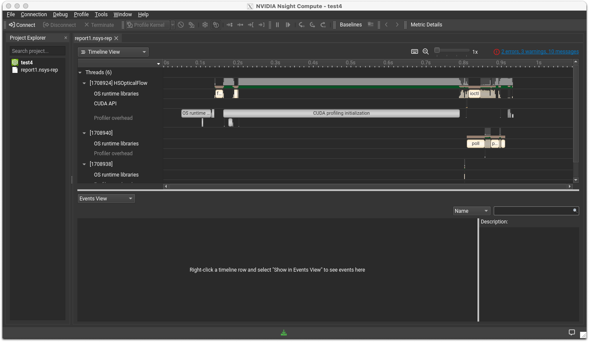

As of February 2024, the genetic research supercomputer system has implemented NVIDIA HPC SDK 23.7. The former PGI Compiler continues its development within the NVIDIA HPC Compiler as part of the NVIDIA HPC SDK.

For versions and components of version 23.7, please refer to the [23.7 Release Notes](https://docs.nvidia.com/hpc-sdk/archive/23.7/hpc-sdk-release-notes/index.html). For limitations and more, see the [Japanese Release Notes](https://hpcworld.jp/nvsdk_releasenotes/version-23-7/).

Considering NVIDIA HPC SDK could be beneficial for:

- Those seeking optimization and acceleration using NVIDIA-manufactured GPUs.
- Building various open-source software that presupposes the use of NVIDIA-manufactured GPUs with optimization considerations.
- Utilizing source codes with OpenACC to generate GPU offload codes.
- Generating optimized object code for various CPUs (Intel, AMD, Arm, OpenPOWER) and comparing performance.
- Utilizing numerical computation libraries developed by NVIDIA that are accelerated using NVIDIA-manufactured GPUs.
- Wanting to use the NCCL library for distributed deep learning (although building from source code might sometimes be simpler).
- Using MPI for hardware offload of MPI collective operations through InfiniBand's SHARP (for large-scale MPI parallelism).
- Developing and debugging applications using CUDA.

Components available on the genetic research supercomputer include:

***Overview of NVIDIA HPC SDK Components***
|Component Name |Description |
|--------------|-----|
|NVIDIA HPC Compiler|(Formerly) PGI compiler, now developed by NVIDIA. Supports OpenMP, OpenACC, and generates optimized code for CPUs (Intel, AMD, Arm, OpenPOWER), and NVIDIA GPUs|
|MPI |Includes hpc-x and OpenMPI based on OpenMPI, supporting SHARP hardware offload |
|CUDA Toolkit|Complete development environment for NVIDIA GPU, including the CUDA compiler, libraries, and header files|
|NSight Systems|Profiler for CPU and GPU |
|NSight Compute| CUDA kernel profiler. Allows detailed profiling using hardware counters within the GPU |
|NCCL|Communication library for distributed deep learning|
|NVSHMEM|Software that extends OpenSHMEM for multi-GPU, multi-node compatibility |
|cuBLAS|GPU-accelerated BLAS on CUDA|
|cuFFT,cuFFTMp|GPU-accelerated FFT, multi-GPU supported FFT library|
|cuRAND|Random number generation library for GPUs|
|cuSOLVER|Package of linear algebra functions on CUDA based on cuBLAS and cuSPARSE|
|cuSPARSE |Sparse matrix computation library on CUDA|
|cuTENSOR,cuTENSORMg|Libraries for accelerating tensor computations on CUDA. Mg supports multi-GPU|
|NVPL ScalaPack |ScaLAPACK enhanced by NVIDIA|
|Thrust,CUB,libcu++|CUDA-compatible C++ template libraries|

NVIDIA HPC SDK can be downloaded from the following site:

- [NVIDIA HPC SDK Download](https://developer.nvidia.com/hpc-sdk-downloads)
- [Explanation on HPC World (examples may be slightly outdated)](https://hpcworld.jp/nvidia-hpc-sdk-install/)

It's possible to develop and debug on your computer and conduct large-scale computations on the genetic research supercomputer. If using systems like NSight Systems with a GUI, you can collect analysis data on the genetic research supercomputer, transfer the results, and display them on the NSight Systems GUI on your local machine.

## NVIDIA HPC Compiler

On the genetic research supercomputer, the NVIDIA HPC compiler is set as the default compiler. Verify the compiler is in the path as follows:

```
which nvc
/opt/pkg/nvidia/hpc_sdk/Linux_x86_64/23.7/compilers/bin/nvc
which nvc++
/opt/pkg/nvidia/hpc_sdk/Linux_x86_64/23.7/compilers/bin/nvc++
which nvfortran 
/opt/pkg/nvidia/hpc_sdk/Linux_x86_64/23.7/compilers/bin/nvfortran
```

### Command Line Usage

The available compilers are as follows:

|Language  | Command |	Command Line |Language Standards & Features|
|------|---------|---------|----------|
|C| nvc|nvc [options] filename |ISO/ANSI C11 with support for OpenMP, OpenACC|
|C++|nvc++| nvc++ [options] filename |ISO/ANSI C++17 with support for OpenMP, OpenACC|
|Fortran|nvfortran|nvfortran [options] filename ||

### Available Compiler Options

General optimization options include specifying the -fast option, recommended by the vendor. The -Minfo option outputs optimization messages during compilation and is also recommended for situation checks. To enable global optimizations

 in the program, enable Interprocedural Analysis. Summarizing, the vendor-recommended option specification is as follows:

```
nvc -fast -Mipa=fast,inline -Minfo test.c (C compiler)
nvc++ -fast -Mipa=fast,inline -Minfo test.cpp (C++ compiler)
```

Depending on the program, further adjusting options may improve performance, but as this is a specialized and extensive topic, it is omitted here. For more details, please refer to the [developer's documentation](https://docs.nvidia.com/hpc-sdk/archive/23.7/compilers/hpc-compilers-user-guide/index.html#cmdln-options-use).

- [HPC SDK Documentation](https://docs.nvidia.com/hpc-sdk/archive/23.7/compilers/hpc-compilers-user-guide/index.html)

For an overview of commonly used options, see below (translated from external sources. Please refer to the original terminology where applicable):

- [External Source Site](https://docs.nvidia.com/hpc-sdk/archive/23.7/compilers/hpc-compilers-user-guide/index.html#freq-used-options)

|Option |  Function |
|----------|-------|
|-⁠acc	| Enables parallelization using OpenACC directives.|
|-⁠fast	|Creates a set of generally optimal flags for targets supporting SIMD capabilities. Includes optimization options that enable vector streaming SIMD instructions, cache alignment, and flushz.|
|-⁠g | Directs the compiler to include symbolic debug information in object modules. Sets the optimization level to zero unless an -O option is present on the command line. Conversely, to prevent the generation of DWARF information, use the -Mnodwarf option.|
|-⁠gpu | Controls the type of GPU for which code is generated, the target version of CUDA, and several other aspects of GPU code generation.|
|-⁠help|Provides information about available options.|
|-⁠mcmodel=medium|Enables code generation for 64-bit targets, effective when the program's data size exceeds 4GB.|
|-⁠mp|Enables parallelization using OpenMP directives. -mp=gpu is used to offload OpenMP regions to NVIDIA GPUs.|
|-⁠Mconcur|Instructs the compiler to enable automatic parallelization of loops. If specified, the compiler will execute loops deemed parallelizable across multiple CPU cores, dividing loop iterations for optimal execution in a multi-threaded context.|
|-⁠Minfo|Instructs the compiler to output information to standard error.|
|-⁠Minline | Enables inlining of functions.|
|-⁠Mipa=fast,inline| Enables interprocedural analysis and optimization.|
|-⁠Munroll | Activates the loop unroller to expand loops, running multiple instances of the loop for each iteration. Also sets the optimization level to 2 unless the optimization level is set to less than 2 or neither the -O nor -g option is specified.|
|-⁠o|Specifies the name of the executable file to be output.|
|-⁠O level | Specifies the code optimization level. The level is 0, 1, 2, 3, or 4.|


### Using OpenMP

NVIDIA HPC Compiler supports OpenMP. From OpenMP 4.0, it also supports offloading to CPUs and other accelerators like GPUs and FPGAs, becoming a general parallel standard for accelerators. Currently supported by Intel, AMD, and NVIDIA, OpenMP has become a general parallel standard across vendors. For detailed usage, please refer to the following site:

- [HPC SDK Documentation Using OpenMP](https://docs.nvidia.com/hpc-sdk/archive/23.7/compilers/hpc-compilers-user-guide/index.html#openmp-use)

- [The OpenMP Specification (OpenMP Organization's site)](https://www.openmp.org/)


### Using OpenACC

NVIDIA HPC Compiler supports OpenACC. For usage information, please refer to the following site:

- [OpenACC Getting Started (NVIDIA) (provides an overview of usage)](https://docs.nvidia.com/hpc-sdk/archive/23.7/compilers/openacc-gs/index.html)

The OpenACC specification is defined by the OpenACC organization and is open. PGI was a major member of the OpenACC organization and contributed to the specification's development. The following external site may be helpful:

- [OpenACC Organization](https://www.openacc.org/)

- [OpenACC Programming and Best Practices Guide](https://openacc-best-practices-guide.readthedocs.io/en/latest/)

While OpenMP tends to be used for portability across Intel/AMD/NVIDIA GPUs, OpenACC might generate more performant code for NVIDIA GPUs since NVIDIA actively supports OpenACC, suggesting a tendency for OpenACC to outperform OpenMP in this scenario.

## Using MPI

In NVIDIA HPC-SDK 23.7, the following two MPI processing systems are installed:

- HPC-X
- OpenMPI 4.1.5

HPC-X is based on OpenMPI and modified by NVIDIA to allow hardware offloading for some collective communications. HPC-X may be specified as the default MPI processing system included in the HPC-SDK by NVIDIA. The installation locations on the genetic research supercomputer are as follows:

|MPI System|Installation Directory|
|--------|--------------------|
|HPC-X|/opt/pkg/nvidia/hpc_sdk/Linux_x86_64/23.7/comm_libs/12.2/hpcx/hpcx-2.15|
|OpenMPI 4.1.5|/opt/pkg/nvidia/hpc_sdk/Linux_x86_64/23.7/comm_libs/12.2/openmpi4/openmpi-4.1.5|

However, the system's default path is set to another MPI implementation (Intel MPI), so to use the desired version, do the following:

To use HPC-X, load `hpcx-init.sh` as follows, then enter `hpcx_load`.

```sh
$ which mpirun
/lustre7/software/intel_ubuntu/oneapi/mpi/2021.11/bin/mpirun
//highlight-start
$ . /opt/pkg/nvidia/hpc_sdk/Linux_x86_64/23.7/comm_libs/12.2/hpcx/hpcx-2.15/hpcx-init.sh 
$ hpcx_load
//highlight-end
$ which mpirun
/opt/pkg/nvidia/hpc_sdk/Linux_x86_64/23.7/comm_libs/12.2/hpcx/hpcx-2.15/ompi/bin/mpirun
$ env |grep HPC
HPCX_HCOLL_DIR=/opt/pkg/nvidia/hpc_sdk/Linux_x86_64/23.7/comm_libs/12.2/hpcx/hpcx-2.15/hcoll
HPCX_CLUSTERKIT_DIR=/opt/pkg/nvidia/hpc_sdk/Linux_x86_64/23.7/comm_libs/12.2/hpcx/hpcx-2.15/clusterkit
HPCX_OSU_CUDA_DIR=/opt/pkg/nvidia/hpc_sdk/Linux_x86_64/23.7/comm_libs/12.2/hpcx/hpcx-2.15/ompi/tests/osu-micro-benchmarks-5.8-cuda
HPCX_OSU_DIR=/opt/pkg/nvidia/hpc_sdk/Linux_x86_64/23.7/comm_libs/12.2/hpcx/hpcx-2.15/ompi/tests/osu-micro-benchmarks-5.8
HPCX_MPI_DIR=/opt/pkg/nvidia/hpc_sdk/Linux_x86_64/23.7/comm_libs/12.2/hpcx/hpcx-2.15/ompi
HPCX_OSHMEM_DIR=/opt/pkg/nvidia/hpc_sdk/Linux_x86_64/23.7/comm_libs/12.2/hpcx/hpcx-2.15/ompi
HPCX_UCC_DIR=/opt/pkg/nvidia/hpc_sdk/Linux_x86_64/23.7/comm_libs/12.2/hpcx/hpcx-2.15/ucc
HPCX_UCX_DIR=/opt/pkg/nvidia/hpc_sdk/Linux_x86_64/23.7/comm_libs/12.2/hpcx/hpcx-2.15/ucx
HPCX_IPM_DIR=/opt/pkg/nvidia/hpc_sdk/Linux_x86_64/23.7/comm_libs/12.2/hpcx/hpcx-2.15/ompi/tests/ipm-2.0.6
HPCX_SHARP_DIR=/opt/pkg/nvidia/hpc_sdk/Linux_x86_64/23.7/comm_libs/12.2/hpcx/hpcx-2.15/sharp
HPCX_IPM_LIB=/opt/pkg/nvidia/hpc_sdk/Linux_x86_64/23.7/comm_libs/12.2/hpcx/hpcx-2.15/ompi/tests/ipm-2.0.6/lib/libipm.so
HPCX_DIR=/opt/pkg/nvidia/hpc_sdk/Linux_x86_64/23.7/comm_libs/12.2/hpcx/hpcx-2.15
HPCX_NCCL_RDMA_SHARP_PLUGIN_DIR=/opt/pkg/nvidia/hpc_sdk/Linux_x86_64/23.7/comm_libs/12.2/hpcx/hpcx-2.15/nccl_rdma_sharp_plugin
HPCX_MPI_TESTS_DIR=/opt/pkg/nvidia/hpc_sdk/Linux_x86_64/23.7/comm_libs/12.2/hpcx/hpcx-2.15/ompi/tests
```

To revert, enter `hpcx_unload` to remove the HPC-X environment settings.

```
$ hpcx_unload
$ env |grep HPCX
$ which mpirun
/lustre7/software/intel_ubuntu/oneapi/mpi/2021.11/bin/mpirun
```

For OpenMPI 4.1.5, add the Compiler Wrapper's path as follows and compile your MPI program:

```
export PATH=/opt/pkg/nvidia/hpc_sdk/Linux_x86_64/23.7/comm_libs/12.2/openmpi4/openmpi-4.1.5/bin:$PATH
mpicc source_code_file -o object_file
```
Also, add the following to `LD_LIBRARY_PATH`:

```
/opt/pkg/nvidia/hpc_sdk/Linux_x86_64/23.7/comm_libs/12.2/openmpi4/openmpi-4.1.5/lib
```

Reference: [Using MPI (NVIDIA SDK Documentation)](https://docs.nvidia.com/hpc-sdk/archive/23.7/compilers/hpc-compilers-user-guide/index.html#mpi-use)

## Using CUDA

CUDA is a parallel programming model for NVIDIA GPUs, developed by NVIDIA. It allows for low-layer GPU programming beyond OpenMP/OpenACC, catering to programmers focusing on computational performance. The NVIDIA HPC Compiler includes the CUDA compiler driver nvcc.

|Language  | Command |	Command Line |Language Standards & Features|
|------|---------|---------|----------|
|NVCC|nvcc|nvcc [options] filename|CUDA C/C++ Compiler driver|

### CUDA-related Environment on the Genetic Research Supercomputer

|Component|Version|Note|
|-------------|---------|----|
|CUDA Driver |12.1 ||
|nvcc Compiler|V12.2.91, V12.1.66|

Please note, due to various reasons, nvcc compilers from the OS, CUDA, and HPC-SDK are installed on the genetic research supercomputer. Installation locations for nvcc are as follows:

HPC-SDK's nvcc compiler driver

```
/opt/pkg/nvidia/hpc_sdk/Linux_x86_64/23.7/cuda/12.2/bin/nvcc --version
nvcc: NVIDIA (R) Cuda compiler driver
Copyright (c) 2005-2023 NVIDIA Corporation
Built on Tue_Jun_13_19:16:58_PDT_2023
Cuda compilation tools, release 12.2, V12.2.91
Build cuda_12.2.r12.2/compiler.32965470_0
```

CUDA 12.1's nvcc compiler driver

```
/usr/local/cuda-12.1/bin/nvcc --version
nvcc: NVIDIA (R) Cuda compiler driver
Copyright (c) 2005-2023 NVIDIA Corporation
Built on Tue_Feb__7_19:32:13_PST_2023
Cuda compilation tools, release 12.1, V12.1.66
Build cuda_12.1.r12.1/compiler.32415258_0
```

nvcc compiler driver in the ubuntu22.04 OS package

```
/usr/bin/nvcc --version
nvcc: NVIDIA (R) Cuda compiler driver
Copyright (c) 2005-2021 NVIDIA Corporation
Built on Thu_Nov_18_09:45:30_PST_2021
Cuda compilation tools, release 11.5, V11.5.119
Build cuda_11.5.r11.5/compiler.30672275_0
```

It's generally recommended to use nvcc from CUDA. If errors occur, try using nvcc from the HPC-SDK for troubleshooting. Do not use the OS-provided version due to version incompatibility with the installed CUDA driver. If using tools like cmake, which might refer to the OS's default settings inadvertently, causing compatibility errors with Ver11.5, ensure cmake options explicitly reference the desired nvcc environment.

When required to specify environment variables like `CUDA_HOME` (which might be deprecated in some software) or `NVHPC_CUDA_HOME`,

 use the following:

```
/usr/local/cuda-12.1
```

By default, the genetic research supercomputer's path is set to nvcc from the NVIDIA HPC-SDK. If needed, switch to nvcc from the CUDA driver as follows:

```
$ which nvcc
/opt/pkg/nvidia/hpc_sdk/Linux_x86_64/23.7/compilers/bin/nvcc
$ export PATH=/usr/local/cuda-12.1/bin:$PATH
$ which nvcc
/usr/local/cuda-12.1/bin/nvcc
```

Also, check if the following path is in `LD_LIBRARY_PATH`:

```
/usr/local/cuda-12.1/lib64
```

If not, add it using:

```
$ export LD_LIBRARY_PATH=/usr/local/cuda-12.1/lib64:$LD_LIBRARY_PATH
```

For information on compiling with nvcc and more, refer to NVIDIA's site:

[NVIDIA CUDA Compiler Driver NVCC](https://docs.nvidia.com/cuda/cuda-compiler-driver-nvcc/index.html)

### CUDA Programming Information

Please refer to the following NVIDIA site for detailed information (omitted here for brevity):

[CUDA C Programming Guide (NVIDIA)](https://docs.nvidia.com/cuda/cuda-c-programming-guide/index.html)

## NVIDIA Nsight Systems

NVIDIA Nsight Systems is a profiler used for evaluating the performance of programs based on CPU/GPU utilization, memory usage, data transfer volume, and more.

- [NVIDIA's Documentation Site](https://docs.nvidia.com/nsight-systems/index.html)
- [NVIDIA's User Guide](https://docs.nvidia.com/nsight-systems/UserGuide/index.html#gpu-metric-sampling)

The basic usage involves collecting a profile as a batch job on the supercomputer and then evaluating that profile information on a login node.

### Capturing a Profile

First, you capture the profile on the supercomputer. The basic command line looks like this. Refer to the job scheduler section for how to write instruction lines in a job script.

- For serial jobs
```
nsys profile your_program [application options]
```
- For parallel jobs

For parallel MPI programs, the command is as follows.
```
nsys profile -o result mpirun [mpi option] mpi_program
```
The `nsys profile` command instructs the program to capture a trace. For MPI, specifying as above allows you to compile analysis results from each process into one file.

### Reviewing the Profile

To view the captured profile data, analyze it using nsys (CLI) or nsys-ui (GUI).

#### Checking with CLI

Use the following command to check:
```
nsys stats report_filename
```

#### Checking with GUI

Here, we describe how to use nsys-ui within the supercomputer and transfer the screen to your PC. Use SSH's X forwarding feature. Ensure an X-Window System or X server emulator is running on your PC. Use a GPU-equipped login node.

Log into the gateway node using `ssh -CX` to enable X11 forwarding.
```
ssh -l username -CX gw.ddbj.nig.ac.jp
Enter passphrase for key '/Users/yxxxxkat/.ssh/id_rsa': 
Last login: Thu Feb 29 23:00:10 2024 from 27.82.201.175
---------------------------------------------------------------------
Thank you for using NIG supercomputer system.
This is the gateway node, do not run program here.
Please use 'qlogin' to login to a login node.
---------------------------------------------------------------------
(base) yxxxx@gw1:~$ 
```
Check the DISPLAY variable setting.
```
env | grep DISPLAY
DISPLAY=localhost:12.0
```
Next, open a separate terminal, log into the gateway node, and login to a login node using `qlogin`. Note the hostname of the login node you're logged into, and from the first terminal, execute:
```
ssh -CX noted_login_node_name
```
Keep this terminal open without closing it; closing it will disable X11 forwarding.

In the terminal where you logged in using `qlogin`, launch nsys-ui.
```
nsys-ui
OpenGL version is too low (0). Falling back to Mesa software rendering.
OpenGL version: "3.1 Mesa 18.1.9 (git-f57f37f3ba)"
```
You should see the NSight Systems logo, followed by a window like the one shown below.


Use File>Open in the menu to open the generated report file. You should see a window like the one shown below.


For detailed analysis methods, please refer to the documentation site's user guide.

## NVIDIA Nsight Compute

NVIDIA Nsight Compute is a profiler tool for CUDA kernels offered by NVIDIA.

- [Nsight Compute Documentation Site](https://docs.nvidia.com/nsight-compute/2022.3/index.html)
- [Nsight Compute Quick Start Guide](https://docs.nvidia.com/nsight-compute/NsightCompute/index.html#quick-start)

Also, refer to the documentation (PDF format) located in the system directory below.

```
/opt/pkg/nvidia/hpc_sdk/Linux_x86_64/23.7/profilers/Nsight_Compute/docs/pdf
@at137:/opt/pkg/nvidia/hpc_sdk/Linux_x86_64/23.7/profilers/Nsight_Compute/docs/pdf$ ls
Archives.pdf              CustomizationGuide.pdf  NsightComputeCli.pdf  ReleaseNotes.pdf
CopyrightAndLicenses.pdf  NsightCompute.pdf       ProfilingGuide.pdf    Training.pdf
```

Both CLI and GUI tools are available. The GUI version is based on X11, so like NSight Systems, X port forwarding settings are required for use on the genetic research supercomputer. The port forwarding setup is similar to NSight Systems. Since it's a CUDA profiling tool, it needs to be launched on a GPU-equipped login node.

It's assumed that you will collect profiling information using CLI and check the results using GUI on the genetic research supercomputer.

### Capturing Analysis Information

Execute the following command line in a job script to run on a computing node. Refer to the job scheduler documentation for the job script directive part.

```
ncu -o profile your_program
```
During execution, messages like the following (example) will be output to the job's standard output.
```
[Vector addition of xxxxxx elements]
==PROF== Connected to process xxxxx
Copy input data from the host memory to the CUDA device
CUDA kernel launch A with 4471 blocks of 256 threads
==PROF== Profiling "vectorAdd_A" - 0: 0%....50%....100% - 46 passes
CUDA kernel launch B with 4471 blocks of 256 threads
==PROF== Profiling "vectorAdd_B" - 1: 0%....50%....100% - 46 passes
Copy output data from the CUDA device to the host memory
Done
==PROF== Disconnected from process xxxxx
==PROF== Report: profile.ncu-rep
```
The job directive will depend on your job script settings, but a file named `profile.ncu-rep` will be output in the CWD from where the job was launched.

The `ncu` command above only instructs the collection of basic information. For more detailed information, refer to the [Profiling Guide](https://docs.nvidia.com/nsight-compute/ProfilingGuide/index.html#sets-and-sections) in the documentation. Please note that the more information you collect, the greater the overhead, so some trial and error may be required.

### Displaying Analysis Results

Here, the procedure for displaying the output report file with the GUI is shown. After setting up port forwarding for forwarding X to the user's terminal (same procedure as NSight Systems), launch with the following command.
```
ncu-ui
```
After the logo is displayed, you will see a window like the one shown below.


Open the report file you previously generated by going to File>Open. You will see a window like the one shown below.



## NCCL (NVIDIA Collective Communication Library)

NCCL is a multi-GPU and multi-node communication library for NVIDIA GPUs and RDMA networks.

- [NVIDIA's NCCL Documentation Site](https://docs.nvidia.com/deeplearning/nccl/user-guide/docs/index.html)

When using NCCL on the genetic research supercomputer, ensure the following directories are included in your `LD_LIBRARY_PATH`:

```
/opt/pkg/nvidia/hpc_sdk/Linux_x86_64/23.7/comm_libs/nccl/lib
/usr/local/cuda-12.1/lib64
```

To verify NCCL's functionality, we provide build instructions and execution results for nccl-tests.

- [NCCL-tests](https://github.com/nvidia/nccl-tests)

**Build Log**
```
(base) yxxxx@igt003:~/NCCL/nccl-tests$ make MPI=1 MPI_HOME=/lustre7/software/intel_ubuntu/oneapi/mpi CUDA_HOME=/usr/local/cuda-12.1/ NCCL_HOME=/opt/pkg/nvidia/hpc_sdk/Linux_x86_64/23.7/comm_libs/nccl
make -C src build BUILDDIR=/lustre7/home/yxxxx/NCCL/nccl-tests/build
make[1]: Entering directory '/lustre7/home/yxxxx/NCCL/nccl-tests/src'
Compiling  timer.cc                            > /lustre7/home/yxxxx/NCCL/nccl-tests/build/timer.o
Compiling /lustre7/home/yxxxx/NCCL/nccl-tests/build/verifiable/verifiable.o
Compiling  all_reduce.cu                       > /lustre7/home/yxxxx/NCCL/nccl-tests/build/all_reduce.o
Compiling  common.cu                           > /lustre7/home/yxxxx/NCCL/nccl-tests/build/common.o
Linking  /lustre7/home/yxxxx/NCCL/nccl-tests/build/all_reduce.o > /lustre7/home/yxxxx/NCCL/nccl-tests/build/all_reduce_perf
Compiling  all_gather.cu                       > /lustre7/home/yxxxx/NCCL/nccl-tests/build/all_gather.o
Linking  /lustre7/home/yxxxx/NCCL/nccl-tests/build/all_gather.o > /lustre7/home/yxxxx/NCCL/nccl-tests/build/all_gather_perf
Compiling  broadcast.cu                        > /lustre7/home/yxxxx/NCCL/nccl-tests/build/broadcast.o
Linking  /lustre7/home/yxxxx/NCCL/nccl-tests/build/broadcast.o > /lustre7/home/yxxxx/NCCL/nccl-tests/build/broadcast_perf
Compiling  reduce_scatter.cu                   > /lustre7/home/yxxxx/NCCL/nccl-tests/build/reduce_scatter.o
Linking  /lustre7/home/yxxxx/NCCL/nccl-tests/build/reduce_scatter.o > /lustre7/home/yxxxx/NCCL/nccl-tests/build/reduce_scatter_perf
Compiling  reduce.cu                           > /lustre7/home/yxxxx/NCCL/nccl-tests/build/reduce.o
Linking  /lustre7/home/yxxxx/NCCL/nccl-tests/build/reduce.o > /lustre7/home/yxxxx/NCCL/nccl-tests/build/reduce_perf
Compiling  alltoall.cu                         > /lustre7/home/yxxxx/NCCL/nccl-tests/build/alltoall.o
Linking  /lustre7/home/yxxxx/NCCL/nccl-tests/build/alltoall.o > /lustre7/home/yxxxx/NCCL/nccl-tests/build/alltoall_perf
Compiling  scatter.cu                          > /lustre7/home/yxxxx/NCCL/nccl-tests/build/scatter.o
Linking  /lustre7/home/yxxxx/NCCL/nccl-tests/build/scatter.o > /lustre7/home/yxxxx/NCCL/nccl-tests/build/scatter_perf
Compiling  gather.cu                           > /lustre7/home/yxxxx/NCCL/nccl-tests/build/gather.o
Linking  /lustre7/home/yxxxx/NCCL/nccl-tests/build/gather.o > /lustre7/home/yxxxx/NCCL/nccl-tests/build/gather_perf
Compiling  sendrecv.cu                         > /lustre7/home/yxxxx/NCCL/nccl-tests/build/sendrecv.o
Linking  /lustre7/home/yxxxx/NCCL/nccl-tests/build/sendrecv.o > /lustre7/home/yxxxx/NCCL/nccl-tests/build/sendrecv_perf
Compiling  hypercube.cu                        > /lustre7/home/yxxxx/NCCL/nccl-tests/build

/hypercube.o
Linking  /lustre7/home/yxxxx/NCCL/nccl-tests/build/hypercube.o > /lustre7/home/yxxxx/NCCL/nccl-tests/build/hypercube_perf
make[1]: Leaving directory '/lustre7/home/yxxxx/NCCL/nccl-tests/src'
```
**Built Modules**

```
all_gather_perf  alltoall_perf   gather_perf     reduce_perf sendrecv_perf  verifiable
all_reduce_perf  broadcast_perf  hypercube_perf  reduce_scatter_perf  scatter_perf  timer.o
```
**Job Script**

```
#!/bin/bash
#$ -cwd
#$ -V
#$ -l gpu 
#$ -l cuda=2 
#$ -l d_rt=192:00:00
#$ -l s_rt=192:00:00
#$ -l s_vmem=20G
#$ -pe mpi 2
#$ -l mem_req=20G
#$ -N example
export LD_LIBRARY_PATH=/opt/pkg/nvidia/hpc_sdk/Linux_x86_64/23.7/comm_libs/nccl/lib:$LD_LIBRARY_PATH
mpirun ./alltoall_perf -b 2 -e 128M -f 2 -g 2
```
**Execution Results**

```
# nThread 1 nGpus 2 minBytes 2 maxBytes 134217728 step: 2(factor) warmup iters: 5 iters: 20 agg iters: 1 validation: 1 graph: 0
#
# Using devices
#  Rank  0 Group  0 Pid 3020421 on     igt002 device  0 [0x15] Tesla V100-SXM2-16GB
#  Rank  1 Group  0 Pid 3020421 on     igt002 device  1 [0x16] Tesla V100-SXM2-16GB
#  Rank  2 Group  0 Pid 1788088 on     igt007 device  0 [0x15] Tesla V100-SXM2-16GB
#  Rank  3 Group  0 Pid 1788088 on     igt007 device  1 [0x16] Tesla V100-SXM2-16GB
#
#                                                              out-of-place                       in-place          
#       size         count      type   redop    root     time   algbw   busbw #wrong     time   algbw   busbw #wrong
#        (B)    (elements)                               (us)  (GB/s)  (GB/s)            (us)  (GB/s)  (GB/s)       
           0             0     float    none      -1    24.28    0.00    0.00      0    18.51    0.00    0.00    N/A
           0             0     float    none      -1    18.34    0.00    0.00      0    18.00    0.00    0.00    N/A
           0             0     float    none      -1    17.82    0.00    0.00      0    18.03    0.00    0.00    N/A
          16             1     float    none      -1    24.52    0.00    0.00      0    24.88    0.00    0.00    N/A
          32             2     float    none      -1    24.66    0.00    0.00      0    24.57    0.00    0.00    N/A
          64             4     float    none      -1    24.31    0.00    0.00      0    24.26    0.00    0.00    N/A
         128             8     float    none      -1    24.60    0.01    0.00      0    24.38    0.01    0.00    N/A
         256            16     float    none      -1    24.36    0.01    0.01      0    24.53    0.01    0.01    N/A
         512            32     float    none      -1    24.57    0.02    0.02      0    24.52    0.02    0.02    N/A
        1024            64     float    none      -1    24.48    0.04    0.03      0    24.54    0.04    0.03    N/A
        2048           128     float    none      -1    24.82    0.08    0.06      0    24.72    0.08    0.06    N/A
        4096           256     float    none      -1    25.48    0.16    0.12      0    24.85    0.16    0.12    N/A
        8192           512     float    none      -1    25.51    0.32    0.24      0    25.48    0.32    0.24    N/A
       16384          1024     float    none      -1    27.51    0.60    0.45      0    27.11    0.60    0.45    N/A
       32768          2048     float    none      -1    30.91    1.06    0.80      0    30.95    1.06    0.79    N/A
       65536          4096     float    none      -1    41.02    1.60    1.20      0    39.79    1.65    1.24    N/A
      131072          8192     float    none      -1    54.38    2.41    1.81      0    53.40    2.45    1.84    N/A
      262144         16384     float    none      -1    82.42    3.18    2.39      0    82.07    3.19    2.40    N/A
      524288         32768     float    none      -1    107.4    4.88    3.66      0    106.5    4.92    3.69    N/A
     1048576         65536     float    none      -1    209.0    5.02    3.76      0    189.6    5.53    4.15    N/A
     2097152        131072     float    none      -1    302.5    6.93    5.20      0    298.7    7.02    5.27    N/A
     4194304        262144     float    none      -1    548.3    7.65    5.74      0    528.9    7.93    5.95    N/A
     8388608        524288     float    none      -1   1143.2    7.34    5.50      0   1118.5    7.50    5.63    N/A
    16777216       1048576     float    none      -1   1993.1    8.42    6.31      0   2178.2    7.70    5.78    N/A
    33554432       2097152     float    none      -1   4842.1    6.93    5.20      0   4511.3    7.44    5.58    N/A
    67108864       4194304     float    none      -1   8972.2    7.48    5.61      0   9271.3    7.24    5.43    N/A
   134217728       8388608     float    none      -1    17761    7.56    5.67      0    17276    7.77    5.83    N/A
# Out of bounds values : 0 OK
# Avg bus bandwidth    : 2.00499 
```

## NVSHMEM (NVIDIA OpenSHMEM Library)

NVIDIA's API for efficient data sharing among GPUs, extending OpenSHEMEM to support GPU clusters.

- [NVIDIA's Documentation Site](https://docs.nvidia.com/nvshmem/api/index.html)

Due to version incompatibilities with the prerequisite CUDA version (12.2 or higher), it has not been verified to work currently. We present the build log of nvshmem's example.

```js
(base) ymuna@igt001:~/nvshmem/examples/build$ cmake -DCMAKE_C_COMPILER=nvc -DCMAKE_CXX_COMPILER=nvc++ -DNVSHMEM_DIR=/opt/pkg/nvidia/hpc_sdk/Linux_x86_64/23.7/comm_libs/12.2/nvshmem/lib/cmake/nvshmem/ ..
-- CUDA_HOME: /usr/local/cuda
-- The CUDA compiler identification is NVIDIA 12.1.66
-- The CXX compiler identification is NVHPC 23.7.0
-- Detecting CUDA compiler ABI info
-- Detecting CUDA compiler ABI info - done
-- Check for working CUDA compiler: /usr/local/cuda/bin/nvcc - skipped
-- Detecting CUDA compile features
-- Detecting CUDA compile features - done
-- Detecting CXX compiler ABI info
-- Detecting CXX compiler ABI info - done
-- Check for working CXX compiler: /opt/pkg/nvidia/hpc_sdk/Linux_x86_64/23.7/compilers/bin/nvc++ - skipped
-- Detecting CXX compile features
-- Detecting CXX compile features - done
-- Found CUDAToolkit: /usr/local/cuda/include (found version "12.1.66") 
-- Looking for C++ include pthread.h
-- Looking for C++ include pthread.h - found
-- Performing Test CMAKE_HAVE_LIBC_PTHREAD
-- Performing Test CMAKE_HAVE_LIBC_PTHREAD - Success
-- Found Threads: TRUE  
-- Performing Test NVCC_THREADS
-- Performing Test NVCC_THREADS - Success
-- Found MPI_CXX: /lustre7/software/intel_ubuntu/oneapi/mpi/2021.11/lib/libmpicxx.so (found version "3.1") 
-- Found MPI: TRUE (found version "3.1")  
-- Configuring done
-- Generating done
-- Build files have been written to: /home/ymuna/nvshmem/examples/build
(base) ymuna@igt001:~/nvshmem/examples/build$ make
[  4%] Building CUDA object CMakeFiles/collective-launch.dir/collective-launch.cu.o
[  9%] Linking CUDA device code CMakeFiles/collective-launch.dir/cmake_device_link.o
//highlight-next-line
nvlink fatal   : Input file '/opt/pkg/nvidia/hpc_sdk/Linux_x86_64/23.7/comm_libs/12.2/nvshmem/lib/libnvshmem_device.a:gpu_coll.cu.o' newer than toolkit (122 vs 121) (target: sm_70)
make[2]: *** [CMakeFiles/collective-launch.dir/build.make:106: CMakeFiles/collective-launch.dir/cmake_device_link.o] Error 1
make[1]: *** [CMakeFiles/Makefile2:95: CMakeFiles/collective-launch.dir/all] Error 2
make: *** [Makefile:136: all] Error 2
```
The nvshmem library, part of the `HPC-SDK`, is built with CUDA 12.2 as a prerequisite. Attempting to link with the nvcc or nvlink from CUDA 12.1 triggers an

 error due to version checks.

- Installation Directory: `/opt/pkg/nvidia/hpc_sdk/Linux_x86_64/23.7/comm_libs/nvshmem`

## cuBLAS

cuBLAS (CUDA Basic Linear Algebra Subroutines Library) operates on the NVIDIA CUDA runtime and is a BLAS library.

- [NVIDIA's Documentation Site](https://docs.nvidia.com/cuda/cublas/index.html#)

It comprises four sets of APIs:

- cuBLAS
- cuBLASXt: Single-node, multi-GPU cuBLAS.
- cuBLASLt: Lightweight library supporting GEMM.

Include the following directory in your `LD_LIBRARY_PATH`:

```
/opt/pkg/nvidia/hpc_sdk/Linux_x86_64/23.7/math_libs/lib64
```
The directory for include files is as follows. Include it in your compile-time include directory.
```
/opt/pkg/nvidia/hpc_sdk/Linux_x86_64/23.7/math_libs/include
```

## cuFFT, cuFFTMp

The CUDA Fast Fourier Transform (FFT) library is for computing FFTs on NVIDIA GPUs. cuFFTMp supports distributed computing across multiple nodes and GPUs.

- [cuFFT Documentation Site](https://docs.nvidia.com/cuda/cufft/index.html#abstract)

Include the following directory in your `LD_LIBRARY_PATH`:

```
/opt/pkg/nvidia/hpc_sdk/Linux_x86_64/23.7/math_libs/lib64
```
The directory for include files is as follows. Include it in your compile-time include directory.
```
/opt/pkg/nvidia/hpc_sdk/Linux_x86_64/23.7/math_libs/include
```

## cuRAND

The cuRAND library generates pseudo or quasi-random numbers on the CPU or GPU.

- [cuRAND Documentation Site](https://docs.nvidia.com/cuda/curand/index.html)

Include the following directory in your `LD_LIBRARY_PATH`:

```
/opt/pkg/nvidia/hpc_sdk/Linux_x86_64/23.7/math_libs/lib64
```
The directory for include files is as follows. Include it in your compile-time include directory.
```
/opt/pkg/nvidia/hpc_sdk/Linux_x86_64/23.7/math_libs/include
```

## cuSOLVER

The cuSOLVER library is a package of linear algebra functions based on cuBLAS and cuSPARSE libraries.

- [cuSOLVER Documentation Site](https://docs.nvidia.com/cuda/cusolver/index.html)

Include the following directory in your `LD_LIBRARY_PATH`:

```
/opt/pkg/nvidia/hpc_sdk/Linux_x86_64/23.7/math_libs/lib64
```
The directory for include files is as follows. Include it in your compile-time include directory.
```
/opt/pkg/nvidia/hpc_sdk/Linux_x86_64/23.7/math_libs/include
```

## cuSPARSE

cuSPARSE offers a set of basic linear algebra subprograms for sparse matrices utilizing the GPU.

- [cuSPARSE Documentation Site](https://docs.nvidia.com/cuda/cusparse/index.html)

Include the following directory in your `LD_LIBRARY_PATH`:

```
/opt/pkg/nvidia/hpc_sdk/Linux_x86_64/23.7/math_libs/lib64
```
The directory for include files is as follows. Include it in your compile-time include directory.
```
/opt/pkg/nvidia/hpc_sdk/Linux_x86_64/23.7/math_libs/include
```

## cuTENSOR, cuTENSORMg

The cuTENSOR library is an implementation of a tensor linear algebra library. cuTENSORMg is the multi-GPU version.

- [cuTENSOR Documentation Site](https://docs.nvidia.com/cuda/cutensor/latest/index.html)

Include the following directory in your `LD_LIBRARY_PATH`:

```
/opt/pkg/nvidia/hpc_sdk/Linux_x86_64/23.7/math_libs/lib64
```
The directory for include files is as follows. Include it in your compile-time include directory.
```
/opt/pkg/nvidia/hpc_sdk/Linux_x86_64/23.7/math_libs/include
```

## NVPL ScaLAPACK

NVPL ScaLAPACK (NVIDIA Performance Libraries ScaLAPACK) is the distributed memory computing counterpart of LAPACK.

- [Scalapack Documentation Site](https://docs.nvidia.com/nvpl/_static/scalapack/index.html)

## Thrust, CUB, libcu++

Thrust is a C++ template library for CUDA based on the STL.

- [NVIDIA's Thrust Documentation Site](https://docs.nvidia.com/cuda/thrust/index.html)

CUB provides CUDA parallel computing primitives.

- [NVIDIA's CUB Documentation Site](https://docs.nvidia.com/cuda/cub/index.html)

- [CUB Documentation on NVIDIA's GitHub](https://nvidia.github.io/cccl/cub/)

libcu++ is the standard C++ library for CUDA.

- [libcu++ Documentation on NVIDIA's GitHub](https://nvidia.github.io/cccl/libcudacxx/)

These are expected to be integrated into the CUDA C++ Core Library (CCCL).

- [CCCL on GitHub](https://github.com/nvidia/cccl)


