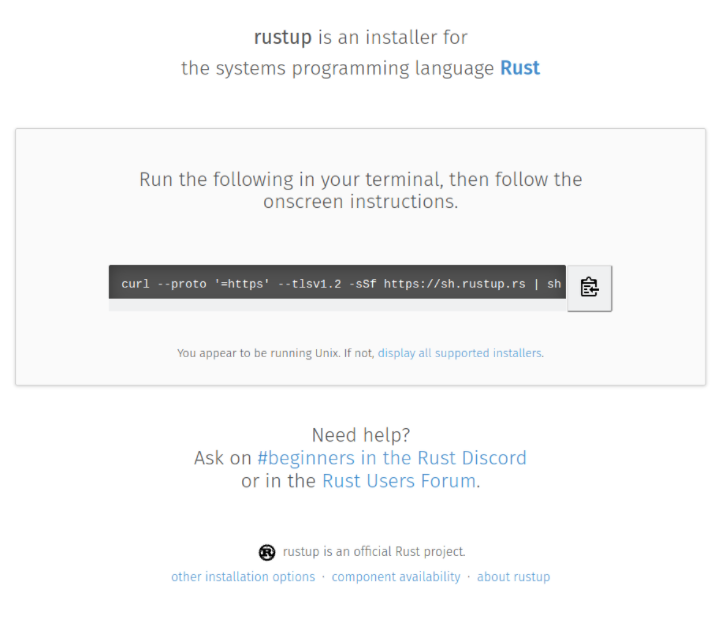

## Rust処理系のインストール
Rustのインストールはユーザー権限で可能なので、各自必要なバージョンを自分のホームディレクトリにインストールしてください。

公式ホームページ [rustup.rs - The Rust toolchain installer](https://rustup.rs/)  にアクセスすると以下のような画面が表示されます。



指示に従ってたった一行をコピーして端末に貼り付け実行すればインストールされます。

- インストール先は` $HOME/.rustup, $HOME/.cargo `。

- Rustのツールにパス等を通し使えるようにするには、` source $HOME/.cargo/env `を実行せよとのこと。

このスクリプトの実行については自動的に` .bashrc `に一行追加される。

```
user01@266fb189884e:~/public_html/docsify_notes/doc_rust001/section02/p2021_0509_RustCompiler (2021-05-09 01:28:28)
$ curl --proto '=https' --tlsv1.2 -sSf https://sh.rustup.rs | sh
curl --proto '=https' --tlsv1.2 -sSf https://sh.rustup.rs | sh
info: downloading installer

Welcome to Rust!
(B
This will download and install the official compiler for the Rust
programming language, and its package manager, Cargo.

Rustup metadata and toolchains will be installed into the Rustup
home directory, located at:

  /home/user01/.rustup
  
This can be modified with the RUSTUP_HOME environment variable.
  
The Cargo home directory located at:
  
  /home/user01/.cargo
	
This can be modified with the CARGO_HOME environment variable.
	
The cargo(B, rustc(B, rustup(B and other commands will be added to
Cargo's bin directory, located at:
	
  /home/user01/.cargo/bin
	  
This path will then be added to your PATH(B environment variable by
modifying the profile files located at:
	  
   /home/user01/.profile
   /home/user01/.bashrc
		  
You can uninstall at any time with rustup self uninstall(B and
these changes will be reverted.
		  
Current installation options:
		  
		  
  (Bdefault host triple: x86_64-unknown-linux-gnu(B
    (Bdefault toolchain: stable (default)(B
              (Bprofile: default(B
   modify PATH variable: yes(B
								   
1) Proceed with installation (default)
2) Customize installation
3) Cancel installation
>1
1
								   
info: (Bprofile set to 'default'
info: (Bdefault host triple is x86_64-unknown-linux-gnu
info: (Bsyncing channel updates for 'stable-x86_64-unknown-linux-gnu'
info: (Blatest update on 2021-05-06, rust version 1.52.0 (88f19c6da 2021-05-03)
info: (Bdownloading component 'cargo'
info: (Bdownloading component 'clippy'
info: (Bdownloading component 'rust-docs'
 15.3 MiB /  15.3 MiB (100 %)   7.6 MiB/s in  2s ETA:  0s
info: (Bdownloading component 'rust-std'
 24.1 MiB /  24.1 MiB (100 %)   7.6 MiB/s in  3s ETA:  0s
info: (Bdownloading component 'rustc'
 48.7 MiB /  48.7 MiB (100 %)   7.3 MiB/s in  6s ETA:  0s
info: (Bdownloading component 'rustfmt'
info: (Binstalling component 'cargo'
info: (Busing up to 500.0 MiB of RAM to unpack components
  6.0 MiB /   6.0 MiB (100 %)   4.1 MiB/s in  1s ETA:  0s
info: (Binstalling component 'clippy'
info: (Binstalling component 'rust-docs'
 15.3 MiB /  15.3 MiB (100 %)  12.4 MiB/s in  1s ETA:  0s
info: (Binstalling component 'rust-std'
 24.1 MiB /  24.1 MiB (100 %)   5.7 MiB/s in  3s ETA:  0s
info: (Binstalling component 'rustc'
 48.7 MiB /  48.7 MiB (100 %)   3.6 MiB/s in 12s ETA:  0s
info: (Binstalling component 'rustfmt'
info: (Bdefault toolchain set to 'stable-x86_64-unknown-linux-gnu'
										   
  stable-x86_64-unknown-linux-gnu installed(B - rustc 1.52.0 (88f19c6da 2021-05-03)
											 
											 
Rust is installed now. Great!
(B
To get started you may need to restart your current shell.
This would reload your PATH(B environment variable to include
Cargo's bin directory ($HOME/.cargo/bin).
											 
To configure your current shell, run:
source $HOME/.cargo/env
user01@266fb189884e:~/public_html/docsify_notes/doc_rust001/section02/p2021_0509_RustCompiler (2021-05-09 01:29:33)
$ 
```

以下のツールがインストールされる。

- ` cargo ` is Rust’s compilation manager, package manager, and general-purpose tool. You can use Cargo to start a new project, build and run your program, and manage any external libraries your code depends on.

- ` rustc ` is the Rust compiler. Usually we let Cargo invoke the compiler for us, but sometimes it’s useful to run it directly.

- `rustdoc ` is the Rust documentation tool. If you write documentation in comments of the appropriate form in your program’s source code, rustdoc can build nicely formatted HTML from them. Like rustc, we usually let Cargo run rustdoc for us.

