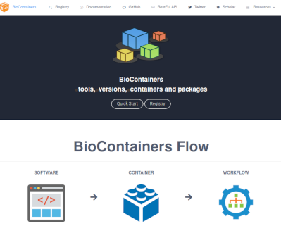

For more information about how to use the software, please click the software name(link) below.

## Job scheduler

<table>
<tr>
<th width="300">area name</th>
<th width="300"> general analysis section</th>
<th width="300">personal genome section</th>
</tr>
<tr>
<td width="300">

[Univa Grid Engine](univa_grid_engine)
</td>
<td width="300">installed</td>
<td width="300">Application Required</td>
</tr>
<tr>
<td width="300">

Slurm
</td>
<td width="300">☓</td>
<td width="300">Application Required</td>
</tr>
</table>

## Package managers

The following package managers can be used only with user permission. They facilitate the construction of development and analysis environments.

<table>
<tr>
<th width="300">area name</th>
<th width="300"> general analysis section</th>
<th width="300">personal genome section</th>
</tr>
<tr>
<td width="300">

[Spack](/software/spack)
</td>
<td width="300">available</td>
<td width="300">available</td>
</tr>
<tr>
<td width="300">

[Nixpkgs (NixOS)](/software/nixpkgs)
</td>
<td width="300">available</td>
<td width="300">available</td>
</tr>

<tr>
<td width="300">

[Environmental Modules](/software/environmental_modules)
</td>
<td width="300">available</td>
<td width="300">available</td>
</tr>

</table>

## Container and analysis pipeline

<table>
<tr>
<th width="300">area name</th>
<th width="300"> general analysis section</th>
<th width="300">personal genome section</th>
</tr>
<tr>
<td width="300">

[Singularity](Singularity)
</td>
<td width="300">installed</td>
<td width="300">installed</td>
</tr>
<tr>
<td width="300"><a href="https://sc.ddbj.nig.ac.jp/advanced_guides/Rhelixa_RNAseq">Rhelixa RNAseq pipeline</a></td>
<td width="300">installed</td>
<td width="300">Application Required</td>
</tr>

<tr>
<td width="300"><a href="https://sc.ddbj.nig.ac.jp/advanced_guides/advanced_guide#dfast">DFAST</a></td>
<td width="300">available</td>
<td width="300">available</td>
</tr>

</table>

## Bioinformatics Tools

<table border="0">
<tr>
<td width="300">

</td>
<td>
<h4>Biocontainers Singularity Images</h4>

Singularity container images created by the BioContainers project (over 2,000 different analysis software and over 90,000 Singularity image files, including different versions) are available in `/user/local/biotools` directory.

Please refer to <a href="https://biocontainers.pro/registry">Registry</a> of <a href="https://biocontainers.pro/">BioContainers' official website</a> for the contents and how to use the software.

</td>
</tr>
</table>

## Data transfer and data sharing

<table>
<tr>
<th width="300">area name</th>
<th width="300"> general analysis section</th>
<th width="300">personal genome section</th>
</tr>
<tr>
<td width="300">

[Aspera](./aspera/aspera.md)

</td>
<td width="300">available</td>
<td width="300">☓</td>
</tr>
<tr>
<td width="300">

[HCPtools](./HCPtools/hcptools.md)

</td>
<td width="300">☓</td>
<td width="300">Application Required</td>
</tr>
</table>

## Development Environment and Libraries

Many development environments are preinstalled on the system. But if you need a specific version for purposes such as reproducing an analysis, you can either install them yourself because Many analysis environments can be installed with user permission or you can use the Singularity container.

<table>
<tr>
<th width="300">area name</th>
<th width="300"> general analysis section</th>
<th width="300">personal genome section</th>
</tr>
<tr>
<td width="300">

[Python](python)

</td>
<td width="300">available</td>
<td width="300">available</td>
</tr>
<tr>
<td width="300">

[R](R)

</td>
<td width="300">available</td>
<td width="300">available</td>
</tr>
<tr>
<td width="300">

[Jupyter Notebook](jupyter_notebook)

</td>
<td width="300">available</td>
<td width="300">available</td>
</tr>
<tr>
<td width="300">

[Jupyter Lab](jupyter_lab)

</td>
<td width="300">available</td>
<td width="300">available</td>
</tr>
<tr>
<td width="300">

R Studio Server

</td>
<td width="300">available</td>
<td width="300">available</td>
</tr>

<tr>
<td width="300">

[Java](java)

</td>

<td width="300">available</td>
<td width="300">available</td>
</tr>
<tr>
<td width="300">

[Node.JS, TypeScript](typescript)
</td>
<td width="300">available</td>
<td width="300">available</td>
</tr>
<tr>
<td width="300">

[Rust](rust)

</td>
<td width="300">available</td>
<td width="300">available</td>
</tr>
<tr>
<td width="300">

C/C++ (GCC)

</td>
<td width="300">available</td>
<td width="300">available</td>
</tr>
<tr>
<td width="300">

C/C++ (Intel Compiler)

</td>
<td width="300">available</td>
<td width="300">☓</td>

</tr>
<tr>
<td width="300">

C/C++ (PGI Compiler)

</td>
<td width="300">available</td>
<td width="300">☓</td>
</tr>
<tr>
<td width="300">

CUDA
</td>
<td width="300">available</td>
<td width="300">available</td>
</tr>
<tr>
<td width="300">OpenMP</td>
<td width="300">available</td>
<td width="300">available</td>
</tr>
<tr>
<td width="300">MPICH</td>
<td width="300">available</td>
<td width="300">available</td>
</tr>

</table>

