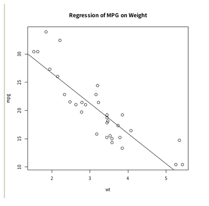

## Introduce

<table border="0">
<tr>
<td width="300">


</td>
<td>
<h4>Biocontainers Singularity Images</h4>

Singularity container images created by the BioContainers project (over 2,000 different analysis software and over 90,000 Singularity image files, including different versions) are available in `/user/local/biotools` directory.

For the contents and how to use the software, refer to <a href="https://biocontainers.pro/registry">Registry</a> of <a href="https://biocontainers.pro/">the BioContainers' official website</a>.

</td>
</tr>
</table>


## Use the Singularity image installed on the supercomputer {#use-singularity-image-of-nig-supercom}

The usage example is as follows:

```
# It's good to set alias to prevent the command from becoming too long.
$ alias singR="singularity exec /usr/local/biotools/r/r-base:3.5.1 R"

$ singR --no-save < example.R
> attach(mtcars)
> plot(wt, mpg)
> abline(lm(mpg~wt))
> title("Regression of MPG on Weight")
>

```


(Citation) The above code example is based on the following website.


[R Tutorial For Beginners](https://www.statmethods.net/r-tutorial/index.html)

The execution result(Rplots.pdf)




